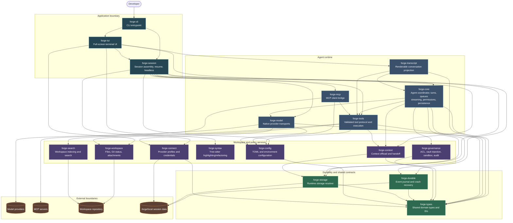

# Forge Architecture

Forge is a Rust workspace for a terminal AI coding agent, editor, and shell. The diagram below reflects the workspace crate boundaries and the primary request/turn lifecycle.

## Runtime flow

1. `forge-cli` parses command-line options and starts the Tokio runtime.
2. `forge-tui` provides the interactive terminal experience, while `forge-session` assembles either an interactive or headless session.
3. `forge-core` coordinates turns: it streams model output, validates and executes tools, applies governance checks, and journals durable events.
4. `forge-model` connects to model providers; `forge-mcp` connects external MCP servers; workspace tools operate on the repository through `forge-workspace` and `forge-search`.
5. `forge-durable` and `forge-storage` preserve resumable session state under repository-local `.forge/local/` storage (or the configured application-data fallback).

`forge-types` is the shared contract layer. `forge-test-support` is intentionally omitted from the runtime diagram because it is test-only infrastructure.
