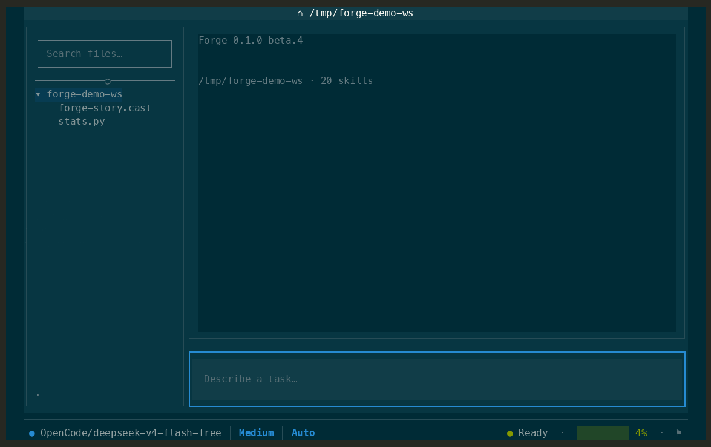

# Forge

[](https://github.com/NorviaLabs/forge/actions/workflows/ci.yml)
[](https://github.com/NorviaLabs/forge/actions/workflows/audit.yml)
[](https://github.com/NorviaLabs/forge/releases)
[](LICENSE)
[](https://www.rust-lang.org/)

_Go from idea to verified code without leaving the terminal—Forge unifies an AI
agent, code editor, and shell in one focused workflow._



Forge is an open-source AI coding agent for your terminal. It runs a
full-screen TUI in the repository you are working on, helps inspect and change
files, runs commands with your approval, and keeps a durable session journal so
you can continue work after an interruption.

Forge is alpha software. Review every approval prompt and use it first in a
disposable or backed-up repository.

## Why this exists

Claude Code is the incumbent for terminal-first AI coding, but its experience
is centered on an agent you drive from a prompt and an external editor you use
alongside it. Forge is for people who want the agent, code editor, file
explorer, shell, approvals, diffs, and durable sessions in one keyboard-driven
workspace, so inspecting code, changing it, and verifying the result stay in a
single focused loop.

## What Forge does

- Chats with a configured model while staying inside your terminal.
- Reads and edits workspace files, applies focused patches, searches code, and
  works with Git.
- Runs every shell command inside an OS sandbox confined to your workspace,
  with network egress restricted to an allow-list.
- Preserves session history and unfinished work in a local SQLite journal.
- Supports provider sign-in and model selection from the TUI.
- Connects configured MCP servers and exposes their tools to the agent.
- Shows files, diffs, command output, activity, diagnostics, and task state in
  one keyboard-driven workspace.

## Install

### Install a prebuilt release

On macOS or Linux:

```sh
curl --proto '=https' --tlsv1.2 -LsSf \
  https://raw.githubusercontent.com/NorviaLabs/forge/main/install/forge-installer.sh | sh
```

On Windows PowerShell:

```powershell
irm https://raw.githubusercontent.com/NorviaLabs/forge/main/install/forge-installer.ps1 | iex
```

The installers select the current release for your platform and verify its
SHA-256 checksum before installing. To install a specific release, set
`FORGE_VERSION`, for example `v0.1.0-beta.5`.

On Linux the installer also installs the sandbox's dependencies —
`bubblewrap` and `socat` — if they are not already present, prompting once
for `sudo`. It supports apt, dnf, yum, pacman, zypper, and apk. If that fails
it says so and continues: forge still runs, but without a sandbox it must ask
before every command. Set `FORGE_SKIP_DEPS=1` to manage them yourself.

macOS needs nothing extra; its sandbox is built into the OS.

Windows runs forge under WSL2, where it uses the Linux sandbox. There is no
native Windows build — the PowerShell installer detects WSL2 and points you
at the Linux installer inside it. The sandbox suite runs against WSL2 in CI.

### Build from source

You need Git and Rust 1.97.1 or newer.

```sh
git clone https://github.com/NorviaLabs/forge.git
cd forge
cargo build --release --locked --package forge-cli
./target/release/forge --version
```

To run the development build:

```sh
cargo run --locked --package forge-cli
```

## Start Forge

Run Forge from the repository you want the agent to work in:

```sh
forge
```

The default workspace is the current directory. Forge also respects the
`FORGE_WORKSPACE` environment variable.

On first launch, Forge walks through theme, directory trust, and provider
connect. A committed theme is stored in your user config; trust is stored
per directory (children inherit). Esc during those steps quits without
claiming setup is done. Later folders only ask for trust. Returning to a
trusted folder opens the normal TUI.

## Providers and models

Forge includes native routes for:

- OpenAI API (`openai/*`)
- Anthropic API (`anthropic/*`)
- xAI Grok through OAuth (`xai/*`)
- OpenAI Codex subscriptions through device login (`openai-codex/*`)
- OpenCode Go (`opencode-go/*`)
- OpenCode Zen (`opencode-zen/*`)
- Ollama running locally (`ollama/*`)

The simplest setup is to export a provider key and model, then launch Forge:

```sh
export OPENAI_API_KEY="..."
export FORGE_MODEL_ID="openai/gpt-4.1-mini"
forge
```

Other API-key environment variables include `ANTHROPIC_API_KEY`,
`OPENCODE_API_KEY`, `OPENCODE_GO_API_KEY`, and `OPENCODE_ZEN_API_KEY`.

For OAuth providers, use `/connect` inside Forge. For Ollama, start the local
Ollama service first, then choose the Ollama route and a locally available
model.

Useful in-app commands:

```text
/connect       Connect or change a provider
/model         Browse or change models
/resume        Browse previous sessions in the current journal
/clear         Clear the visible transcript
/compact       Compact the active context
/disconnect    Remove a saved provider connection
/refresh       Refresh the file explorer's Git state
/edit          Open the active file in your editor
/context-file  Attach the active file to the next message
/theme         Change the presentation theme
/help          Open help
/quit          Exit Forge
```

`/resume <session-id>` resumes a specific session. The command-line form
`forge --resume <session-id>` does the same; bare `forge --resume` resumes the
most recently modified session when one exists.

## Keyboard controls

Forge displays contextual hints for the current focus. The most useful global
controls are:

| Key | Action |
| --- | --- |
| `Tab` / `Shift+Tab` | Move between visible blocks |
| `Enter` / `i` | Interact with the focused block or control |
| `Esc` | Leave the current interaction level |
| `↑` / `↓` | Navigate a local list or input |
| `Ctrl+Backtick` | Toggle the bottom panel |
| `Alt+1`–`Alt+3` | Open a bottom-panel tab |
| `Shift+←` / `Shift+→` | Switch the active block's tab |
| `F2` | Cycle permission mode (Manual ↔ Accept Edits) |
| `F3` | Focus composer chips (mode · connect · model · effort) |
| `F4` | Open model picker |
| `Ctrl+Shift+V` | Attach a screenshot from the local OS clipboard |
| `?` | Open help |

The composer shows a chip row under the input: permission mode, connection,
model, and effort. `F3` then `←`/`→`/`Enter` activates a chip (disconnected
→ connect flow). `Enter` still sends; `⏎` is a hint only. `Ctrl+Shift+V`
attaches a PNG/JPEG/GIF/WebP from the local clipboard (workspace-only;
SSH has no image clipboard). The model can also call `view_image` on a
workspace file when the active model accepts image input.

When the bottom panel is focused, it is an interactive login shell. Type or
paste commands directly into it; standard control keys, arrows, Tab, and
terminal resize are forwarded to the shell. `Ctrl+Backtick` closes the panel.

When a text file is open, the workspace uses Vim-style editing. Files start in
Normal mode; press `i` to insert, `Esc` to return to Normal mode, and `Alt+E`
to hand the file to `$VISUAL`/`$EDITOR`. In Normal mode, `:` opens the editor
command line. The beta command set includes `:w`, `:q`, `:q!`, `:wq`, `:x`,
`:e [path]`, `:s/pattern/replacement/[g]`, and `:%s/pattern/replacement/[g]`.
Saving is immediate. Forge asks whether to save, discard, or cancel before
leaving or switching away from dirty buffers, and asks whether to reload or
force-save when the file changed on disk. Binary and invalid-UTF-8 files stay
explicitly read-only.

## Configuration

Forge reads defaults, a user configuration file, a `forge.toml` in the
working directory, and environment variables. Environment variables override
file configuration.

A minimal project `forge.toml` can look like this:

```toml
[model]
model = "openai/gpt-4.1-mini"

[tui]
theme = "forge-dark"
file_icons = "unicode"

[journal]
path = ".forge/sessions"
```

### Themes

Forge ships built-in themes you can pick with `/theme` or set in `forge.toml`.
Bare `/theme` opens a bottom dock: ↑↓ live-previews against the real UI, Enter
confirms, Esc restores the previous theme. `/theme <id>` applies immediately.

| Theme id | Name |
| --- | --- |
| `forge-dark` | Forge Dark (default) |
| `solarized-dark` | Solarized Dark |
| `solarized-light` | Solarized Light |
| `catppuccin-mocha` | Catppuccin Mocha |
| `gruvbox-dark` | Gruvbox Dark |
| `kanagawa-wave` | Kanagawa Wave |
| `system` | Follow terminal light/dark preference |

Drop custom `.toml` theme files into `.forge/themes/` in your workspace or
`~/.config/forge/themes/` to add or override themes. See
`crates/forge-tui/themes/` for the schema and examples.

Common environment variables are:

```text
FORGE_MODEL_ID
FORGE_MODEL_PROVIDER
FORGE_API_KEY
FORGE_WORKSPACE
FORGE_JOURNAL_PATH
FORGE_MODEL_REQUEST_TIMEOUT_SECS
```

Forge stores session journals in repository-local runtime storage when
possible, or in the platform application-data directory outside a Git
repository. Runtime data is not source code and should not be committed.

### MCP servers

MCP servers can be configured in a trusted user config or an explicitly
managed configuration:

```toml
[[mcp.servers]]
id = "my-tools"
transport = "stdio"
command = "my-mcp-server"
args = ["--stdio"]
```

Project-discovered configuration is intentionally restricted: settings that
could execute code or redirect credentialed requests are not accepted from an
untrusted checked-out repository.

### The sandbox

Every shell command the agent runs is confined by the operating system, in
every permission mode. Confinement is applied at spawn, so it does not depend
on the agent classifying a command correctly beforehand — forge does not try
to decide whether `rm -rf` is dangerous, it removes the reach that would make
it matter.

| Platform | Mechanism |
| --- | --- |
| macOS | Seatbelt (`sandbox-exec`), built into the OS |
| Linux | bubblewrap (`bwrap`) |
| Windows | WSL2, using the Linux sandbox |

Inside the sandbox a command can:

- **read** broadly, so toolchains and system libraries work;
- **write** only inside your workspace and a per-session temp directory;
- **reach the network** only through the egress proxy described below.

`.git` and `.forge` are read-only: the agent can inspect history but cannot
rewrite it, and cannot edit the permission rules that govern it.

If the OS cannot confine — bubblewrap missing, an unsupported platform — forge
does not pretend otherwise. It caps the session at Manual mode and tells you
why. Auto is unreachable without a sandbox under it; there is no combination
of settings that turns oversight off without an enforcement floor in place.

### Network egress

The sandbox denies network access outright, then reinstates it through a
filtering proxy reached over a Unix socket. The proxy reads the `CONNECT` host
each request names and refuses anything not on the allow-list. It does not
terminate TLS, install a certificate, or see your traffic — it only decides
where a connection may go.

The allow-list currently seeds the package registries a first build needs
(crates.io, github.com, npm, PyPI) and denies everything else. Seeding is a
policy decision made on your behalf, and it is the weakest part of this
design: forge has no per-domain prompt yet, so a seeded list is the
alternative to `cargo build` failing on a fresh clone. When per-domain
prompting exists, this becomes the fallback rather than the default.

### Permission rules

`permissions.toml` narrows or widens what runs without a prompt, with pattern
rules matched against the actual call — a command prefix
for shell tools, a path glob for file tools, a host for fetch-style tools:

```toml
allow = ["bash(cargo test *)", "bash(cargo build*)"]
deny = ["bash(cargo publish*)"]
```

A `deny` entry carves an exception out of a broader `allow` entry (`cargo *`
allowed, but `cargo publish` still asks); it never blocks a call outright —
that's still the ACL's job. Two files are read and merged:

- `<user config dir>/forge/permissions.toml` — personal, trusted.
- `.forge/permissions.toml` in the workspace — repo-committed, and for the
  same reason project-discovered MCP config is restricted above, its `allow`
  entries are ignored. A checked-out repository cannot grant itself a wider
  blast radius than a human approved locally. Its `deny` entries are always
  honored, since narrowing approval further is safe regardless of source.

Menu rows (when a prompt appears):

- **Run once** — run this call; ask again next time.
- **Remember similar commands this session** — remember a generalized
  family for the rest of the session. The selected row explains what would
  match (for example `git push …`). Matching commands later run without a
  prompt; a different family still asks. Not written to `permissions.toml`.
- **Don't run** — block the call.

### Permission modes

`F2` cycles the session's oversight level (persisted per workspace).
Default is **Accept Edits**, shown in the composer as **Auto**.

The mode decides only whether you are *asked*. It never decides what a command
can *reach* — the sandbox does that, identically in both modes.

- **Accept Edits / Auto** (default) — shell commands run without prompting,
  because they are already confined to your workspace with no unrestricted
  network. Asking on top of that is friction without added safety. File writes
  are free for the same reason. MCP tools still prompt: those are separate
  server processes and the sandbox does not confine them.
- **Manual** — the same confinement, plus a prompt before every
  shell-equivalent command, unless your personal `permissions.toml` (or a
  session `always`) allows it.

Auto requires a working sandbox. On a host that cannot confine, the mode is
capped at Manual and the composer chip explains why.

Modes never override an ACL deny or ignore your `permissions.toml` rules: a
`deny` pattern is checked first and re-prompts in Auto exactly as in Manual.
A stricter `Locked` mode is deferred until headless/CI entry exists.

### Approving shell commands

When a command needs approval, use the inline menu:

- **↑ / ↓** — move selection (default: Run once)
- **Enter** — confirm
- **Esc** — don’t run (or back out of “Deny with note”)

Optional text aliases still work: `yes`, `no`, `remember`, `always`,
`no <note>`.

## Built-in tools

Depending on configuration, the agent can use tools for:

- reading and writing files;
- applying validated workspace-confined patches;
- running shell commands inside the sandbox;
- inspecting Git status and diffs;
- fast file and content search;
- web search;
- configured MCP tools.

Tool arguments are validated before execution, and shell commands are confined
by the OS sandbox rather than judged for danger beforehand. Forge does not
treat model output as trusted input.

## Sessions and resume

Every Forge session has a durable identifier and journal. If a process stops
unexpectedly, start Forge with:

```sh
forge --resume
```

or resume a known session directly:

```sh
forge --resume <session-id>
```

Inside the TUI, `/resume` lists previous sessions and shows a title hint from
the first user message when available. Session journals stay separate from
your source files and should never contain API keys or OAuth tokens.

## Safety

Forge can execute commands and modify files on your machine. Treat it like a
shell with an AI interface:

1. Run it only in repositories you trust. The sandbox confines what a command
   can reach; it does not make an untrusted repository safe to build.
2. Read each approval prompt, including the exact command and consequence.
   In Auto mode most shell commands do not prompt — the sandbox is what
   stands in for that review, so check that it is active (the composer chip
   says when the mode is capped).
3. Keep credentials in your environment or trusted user configuration. The
   sandbox restricts where a command may connect, but a command that legitimately
   reaches an allow-listed host can carry whatever it can read.
4. Do not commit `.forge/`, runtime journals, API keys, OAuth tokens, or
   credential files.
5. Use a disposable clone when evaluating an unfamiliar repository.

See [SECURITY.md](SECURITY.md) for the threat model and private vulnerability
reporting process.

## Development

Forge is a Rust workspace. The main crates are:

- `forge-cli` — command-line entry point;
- `forge-tui` — terminal interface;
- `forge-core` — agent loop and session lifecycle;
- `forge-model` — provider transports and message normalization;
- `forge-connect` — provider profiles, credentials, and model catalog;
- `forge-tools` — built-in tools and validation;
- `forge-durable` — SQLite session journals.

Run the standard checks before submitting a change:

```sh
cargo fmt --all -- --check
cargo clippy --workspace --all-targets --locked -- -D warnings
cargo test --workspace --all-targets --locked
```

See [CONTRIBUTING.md](CONTRIBUTING.md) for contribution guidance.

## License

Forge is available under the [MIT License](LICENSE).
