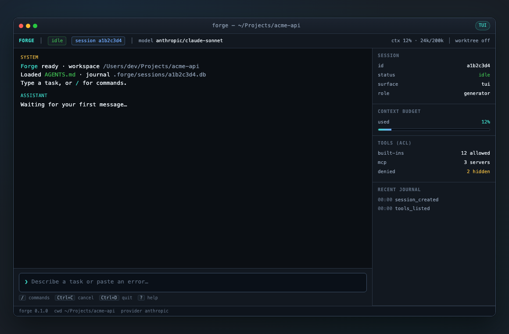
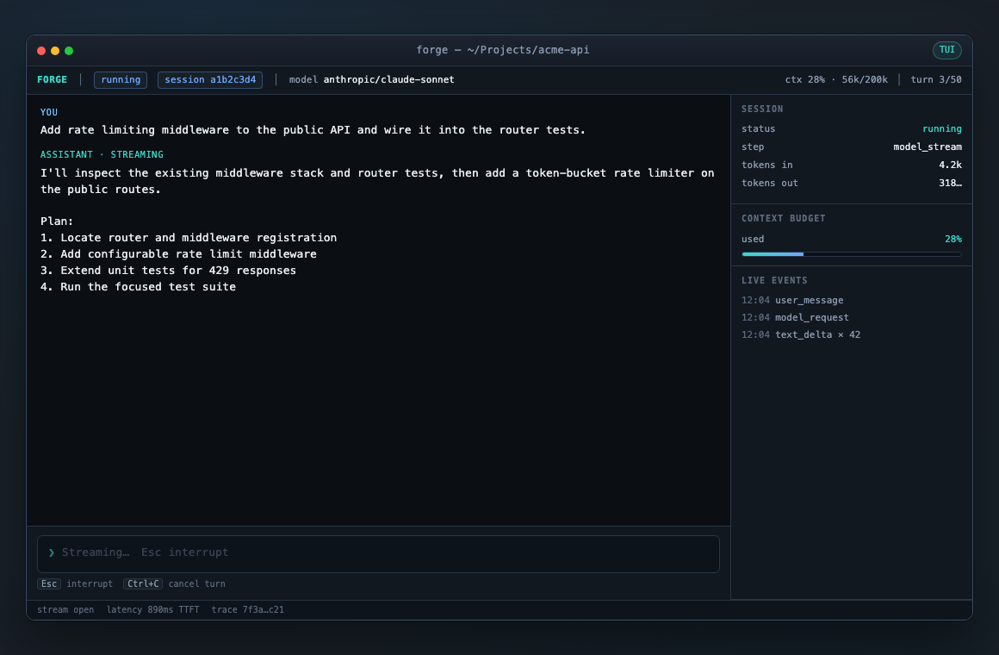
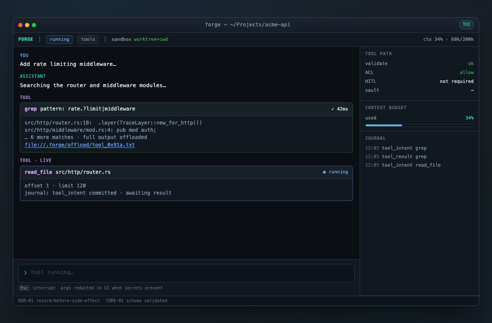
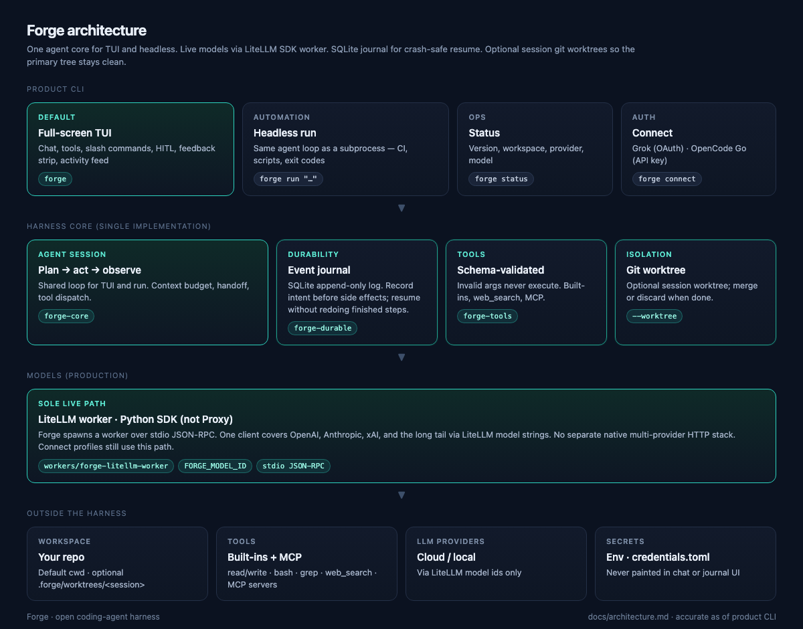

# Forge

**AI coding agent for your terminal.** Durable sessions, real tools, any model — one command.

[](./LICENSE)
[](https://www.rust-lang.org/)

Forge runs a coding agent with schema-validated tools, crash-safe resume, and a full-screen TUI. You provide the model (via LiteLLM); Forge handles tools, context, approvals, and recovery.

```bash
forge              # full-screen TUI
forge status       # version, workspace, model
forge run "…"      # headless
```

**[Architecture](./docs/architecture.md)**

---

## Screenshots

<p align="center">
  
</p>

<p align="center">
  
  &nbsp;
  
</p>

---

## Install

**Need:** Rust 1.80+, Python 3 (live models).

```bash
git clone https://github.com/NorviaLabs/forge.git
cd forge
cargo build --release -p forge-cli
export PATH="$PWD/target/release:$PATH"
pip install -e workers/forge-litellm-worker   # live models only
```

---

## Quick start

```bash
export OPENAI_API_KEY=…                    # or ANTHROPIC_API_KEY / XAI_API_KEY / …
export FORGE_MODEL_ID=openai/gpt-4.1-mini  # any LiteLLM model string

forge                              # TUI
forge run "Summarize this repo"    # headless
forge --resume <session-id>        # resume in TUI
forge --worktree run "…"           # isolate edits in a git worktree
```

### Connect Grok or OpenCode Go

```bash
forge connect list
forge connect opencode_go --key "$OPENCODE_API_KEY"
# xAI Grok: OAuth via /connect in the TUI
```

Credentials: `~/.config/forge/credentials.toml` (mode `0600`).

---

## Configuration

Optional. Defaults work; env and flags override. Files (if present): `~/.config/forge/config.toml`, `./forge.toml`.

| Env | |
|-----|--|
| `FORGE_MODEL_ID` | LiteLLM model (`openai/…`, `anthropic/…`, `xai/…`) |
| `FORGE_MODEL_PROVIDER` | `litellm` |
| `OPENAI_API_KEY` / … | Provider keys for the worker |
| `FORGE_WORKSPACE` | Project root (default: cwd) |

---

## CLI

```text
forge [OPTIONS] [COMMAND]
```

| Command | |
|---------|--|
| *(none)* | Open the TUI |
| `run <prompt>` | Headless agent |
| `status` | Version / workspace / model |
| `connect [profile]` | Provider profiles |

**Flags:** `--config` · `--workspace` · `--model` · `--worktree` · `--resume` · `--max-turns`

**Exit codes:** `0` ok · `1` failed · `2` awaiting HITL · `3` canceled · `4` config

---

## Architecture

One agent core for TUI and headless. Live models use a Forge-managed **LiteLLM SDK worker**. Sessions journal for crash-safe resume.

<p align="center">
  
</p>

---

## License

[MIT](./LICENSE) © 2026 NorviaLabs
