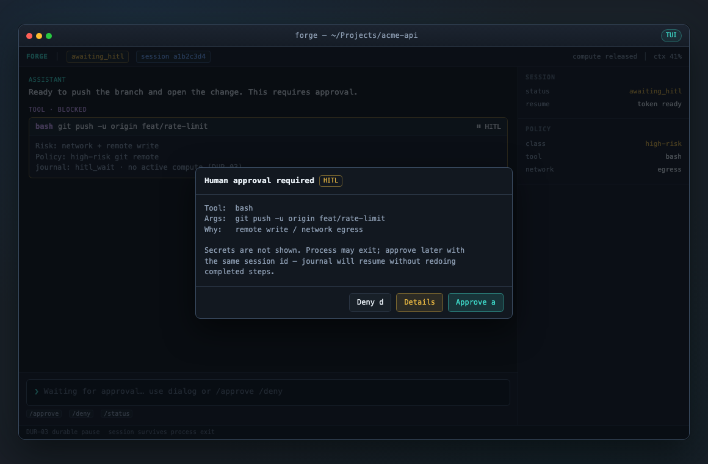
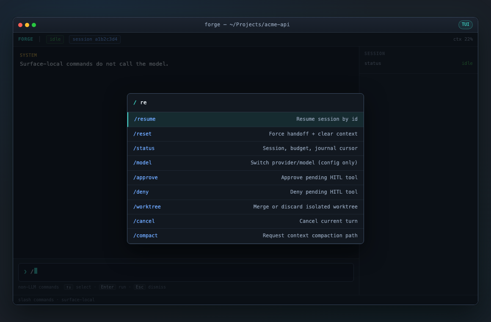

# Forge

**AI coding agent for your terminal.** Durable sessions, real tools, any model — one CLI.

[](./LICENSE)
[](https://www.rust-lang.org/)
[](https://github.com/NorviaLabs/forge)

Forge is a **coding agent harness**: it runs a plan–act–observe loop with schema-validated tools, crash-safe session resume, and a full-screen TUI. You bring the model (via LiteLLM); Forge handles tools, context, approvals, and recovery.

**[Repository](https://github.com/NorviaLabs/forge) · [Product requirements](./docs/prd.md) · [Architecture](./docs/architecture.md) · [TUI UI](./docs/ui.md)**

---

## Terminal UI

Full-screen session view: status chrome (provider · model · context), chat, tools, and sidebar.

<p align="center">
  
</p>

| Chat & tools | Approvals & safety |
|:---:|:---:|
|  |  |
|  |  |

More screens (context handoff, resume, worktree, errors): **[docs/ui.md](./docs/ui.md)** · [all mockups](./docs/ui/images/).

---

## What you can do

| Goal | How |
|------|-----|
| Chat and edit code in a full-screen UI | `forge tui` |
| One-shot task from the shell | `forge run "…"` |
| Interactive line mode | `forge repl` |
| Connect Grok or OpenCode Go | `forge connect` or `/connect` in the TUI |
| Safe experimental edits | `forge --worktree run "…"` |
| Offline / CI without a model | `forge --mock …` |
| Resume after a crash | `forge tui --resume <session-id>` |

---

## Why Forge?

| Problem | What Forge does |
|---------|-----------------|
| Agent dies mid-task | Append-only journal; resume without redoing finished tool calls |
| Invalid tool args blow up the run | Schema validation before side effects; model can retry |
| Secrets leak into chat | Keys stay in env / credential store / vault — not in prompts |
| Only one model vendor | **LiteLLM** as the single production path (OpenAI, Anthropic, xAI, long tail) |
| “What just failed?” | TUI shows provider · model · context, feedback strip, activity feed, error banners |
| Repo edits feel unsafe | Optional **git worktree** isolation; HITL for high-risk actions |

**Honest limits:** Forge does not replace your model provider (rate limits, auth, and quality are upstream). Web search needs a search API key for live results (mock works offline).

---

## Install

**Prerequisites:** Rust (1.80+), and for live models: Python 3 + the LiteLLM worker.

```bash
git clone https://github.com/NorviaLabs/forge.git
cd forge
cargo build --release -p forge-cli

# Live models only — Python worker (LiteLLM library, not the Proxy product)
pip install -e workers/forge-litellm-worker

# Optional: put the binary on your PATH
export PATH="$PWD/target/release:$PATH"
forge status
```

---

## Quick start

### 1. Try it offline (no API keys)

```bash
forge --mock status
forge --mock run "hello"
forge --mock tui          # full-screen UI
forge --mock repl         # line-mode chat
```

### 2. Run with a live model

```bash
pip install -e workers/forge-litellm-worker

export OPENAI_API_KEY=…          # or ANTHROPIC_API_KEY / XAI_API_KEY / …
export FORGE_MODEL_PROVIDER=litellm
export FORGE_MODEL_ID=openai/gpt-4.1-mini

forge run "Summarize what this repository does"
forge tui
```

### 3. Connect product profiles (TUI or CLI)

```bash
forge connect list
# OpenCode Go — API key (prompted in TUI)
forge connect opencode_go --key "$OPENCODE_API_KEY"
# xAI Grok — OAuth (TUI flow; CLI may use fixture/dev paths)

# In the TUI:
#   /connect          → pick a provider
#   /model            → switch model
#   /status           → session · provider · model · context
```

Credentials go to `~/.config/forge/credentials.toml` (mode `0600`). Never commit keys.

### 4. Everyday TUI tips

| Keys / input | Action |
|--------------|--------|
| Type a task + **Enter** | Send to the agent |
| `/status`, `/tools`, `/cost`, `/help` | Commands in the main textbox |
| `/` + **↑/↓** + **Tab** | Slash suggestions + complete |
| **Ctrl+K** | Full command palette |
| **↑/↓** (no slash panel) | Command history |
| **Esc** | Clear input / dismiss info feedback |

Chrome shows **provider · model · context %**, a **feedback** line for status/errors, and an **ACTIVITY** sidebar on wide terminals.

---

## Built-in tools

The agent can use tools such as:

| Tool | Purpose |
|------|---------|
| `read_file` / `write_file` | Workspace files |
| `bash` | Shell in the workspace |
| `grep` | Search the tree |
| `web_search` | Public web search (see below) |

Plus tools from configured **MCP** servers.

### Web search

Default is **mock** (no key, offline). For real results:

```toml
# forge.toml (project) or ~/.config/forge/config.toml
[tools.web_search]
enabled = true
provider = "tavily"   # mock | tavily | brave | serper
# api_key_env = "TAVILY_API_KEY"
```

```bash
export TAVILY_API_KEY=…   # or BRAVE_API_KEY / SERPER_API_KEY
```

---

## Configuration

Merge order: defaults → `~/.config/forge/config.toml` → `./forge.toml` → env → CLI flags.

| Env | Meaning |
|-----|---------|
| `FORGE_MODEL_PROVIDER` | `litellm` or `mock` |
| `FORGE_MODEL_ID` | LiteLLM model string, e.g. `anthropic/claude-sonnet` |
| `FORGE_API_KEY` | Optional key passthrough to the worker |
| `FORGE_WORKSPACE` | Workspace root (default: cwd) |
| `FORGE_WEB_SEARCH_PROVIDER` | `mock` / `tavily` / `brave` / `serper` |
| `OPENAI_API_KEY` / `ANTHROPIC_API_KEY` / `XAI_API_KEY` | Provider keys for LiteLLM |

Example `forge.toml`:

```toml
[model]
provider = "litellm"
model = "openai/gpt-4.1-mini"

[model.litellm]
python = "python3"
module = "forge_litellm_worker"

[tools.web_search]
enabled = true
provider = "mock"
```

---

## CLI reference

```text
forge [OPTIONS] <COMMAND>
```

| Command | Description |
|---------|-------------|
| `status` | Version, workspace, model |
| `run <prompt>` | Headless one-shot agent turn(s) |
| `repl` | Interactive line-mode agent |
| `tui` | Full-screen terminal UI |
| `connect [profile]` | List / connect / status for Grok & OpenCode Go |
| `approve` / `deny` | Resolve human-in-the-loop for a session |
| `feedback` | Run quality sensors (EVAL) |
| `channel` | Restricted channel-style ingress |
| `fleet` | Fleet plugins / SIEM demo hooks |

**Global flags:** `--config` · `--workspace` · `--provider` · `--model` · `--mock` · `--worktree`

**Useful options:**

```bash
forge run "…" --resume <uuid> --max-turns 16
forge tui --resume <uuid>
forge --worktree --mock run "try a risky edit"
```

**Exit codes:** `0` success · `1` failed · `2` awaiting HITL · `3` canceled · `4` config error

---

## How it works

One agent core for every surface. Live models go through a Forge-managed **LiteLLM Python SDK** worker (not the LiteLLM Proxy). Sessions are journaled for crash-safe resume.

<p align="center">
  
</p>

<details>
<summary>Regenerate the architecture diagram</summary>

```bash
CHROME="/Applications/Google Chrome.app/Contents/MacOS/Google Chrome"
"$CHROME" --headless=new --disable-gpu --hide-scrollbars \
  --window-size=1200,960 \
  --screenshot=docs/images/architecture.png \
  "file://$(pwd)/docs/images/architecture.html"
```

Source: [docs/images/architecture.html](./docs/images/architecture.html). Full write-up: [docs/architecture.md](./docs/architecture.md).

</details>

---

## Documentation

| For you | Link |
|---------|------|
| Product goals & roadmap | [docs/prd.md](./docs/prd.md) |
| System design | [docs/architecture.md](./docs/architecture.md) |
| TUI screens & layout | [docs/ui.md](./docs/ui.md) |
| Design specs (by phase) | [docs/designs/README.md](./designs/README.md) |
| LiteLLM worker | [workers/forge-litellm-worker/README.md](./workers/forge-litellm-worker/README.md) |

---

## Development

```bash
cargo test
cargo build --release -p forge-cli
cargo test -p forge-tui
```

Contributions and issues welcome on [GitHub](https://github.com/NorviaLabs/forge).

---

## License

[MIT](./LICENSE) © 2026 NorviaLabs
