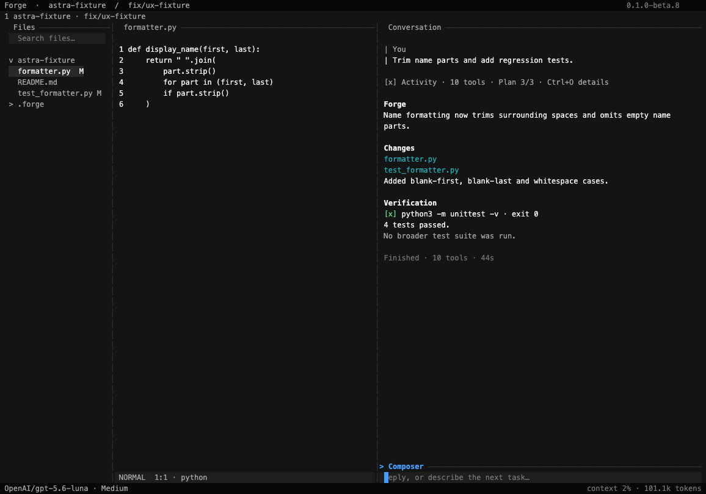
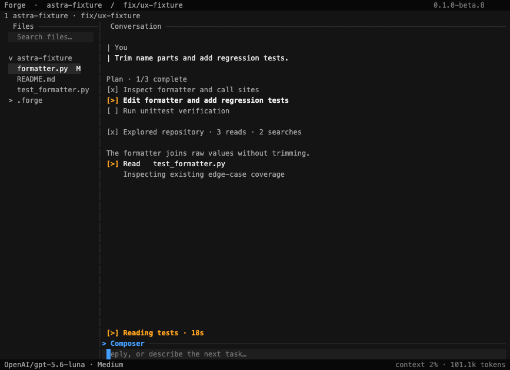
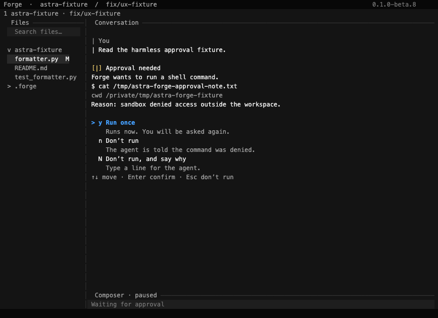
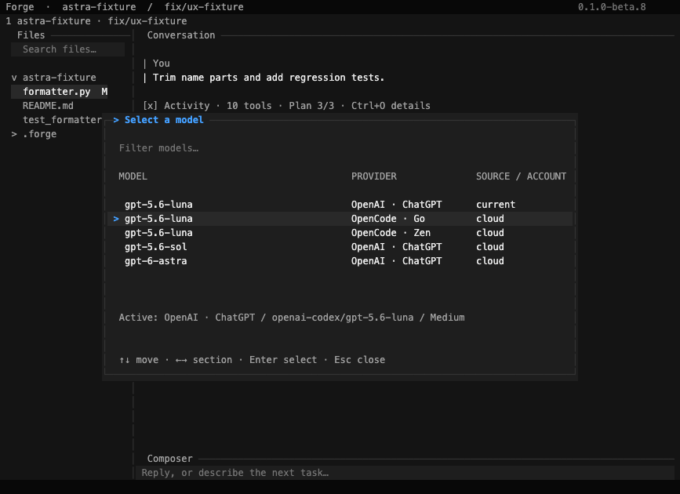

# Before / after gallery

CURRENT examples below are transcribed from real PTY captures against the TUI source present at final baseline `dfa46a07aa43551395ba7cb6b4867ab2d8a9c324`; they are excerpts, not reconstructed screenshots. PROPOSED examples are design fixtures. Open the [interactive prototype](prototype/index.html) for full geometry, themes, keyboard focus and all 30 states.

## 1. Full workspace

CURRENT: Files search box inside Files box; separate workspace, chat and composer rectangles; at 120 columns an opened file leaves chat roughly 30 columns.

PROPOSED: shared separators, one-row search, 22-column Files / 42-column workspace / 52-column chat at 120×35. [States 02, 29](prototype/index.html?state=29).



WHY: usable conversation while reading code, and less chrome without abandoning pane identity. [Current editor capture](current/forge-editor-120x35.txt).

## 2. Active agent

CURRENT:
```text
Thought
… narration …
Write stdin  166s · ↓ 293 chars
Working · context 16% · 1.1M tokens …
```
PROPOSED:
```text
[>] Shell  python3 -c "…"
    session #1 · running
[>] Running command · 2m 46s
```
WHY: the label describes the ongoing command rather than the polling transport. One live status owns elapsed time. [Current](current/forge-long-running-220x55.txt), [states 07–09](prototype/index.html?state=9).

## 3. Tool-heavy turn

CURRENT: compact exploration exists, but expanding exposes large raw payloads; polling calls remain individual groups.

PROPOSED:
```text
[x] Explored repository · 3 reads · 2 searches
[>] Read   test_formatter.py
```


WHY: preserve existing grouping and Ctrl+O; refine boundaries and process identity instead of adding new navigation. [Current](current/forge-summary-active-120x35.txt), [states 08, 17](prototype/index.html?state=17).

## 4. Plan

CURRENT:
```text
Plan · 3 of 3 done
[✓] Inspect fixture…
    ls ., read_file formatter.py, read_file test_formatter.py
[✓] Edit…
    apply_patch
```
PROPOSED:
```text
Plan · 1/3 complete
[x] Inspect formatter and call sites
[>] Edit formatter and add regression tests
[ ] Run unittest verification
```
WHY: current step is strongest; finished metadata recedes. Latest plan replaces prior compact revision, with history retained in details. [Current](current/forge-plan-active-120x35.txt), [state 06](prototype/index.html?state=6).

## 5. Approval

CURRENT: `Waiting · approval`, `Approval needed`, waiting strip, paused composer and waiting footer coexist; reason truncates.

PROPOSED: one inline approval, exact command/reason/cwd, original options, local hint. No new Always Allow action.



WHY: the decision has one visual owner, while background work stops competing. [Current](current/forge-approval-120x35.txt), [state 10](prototype/index.html?state=10).

## 6. Final answer

CURRENT: completed plan metadata, generated diffs, narration and answer use similar vertical weight; global timing can sit below later turns.

PROPOSED:
```text
[x] Activity · 10 tools · Plan 3/3 · Ctrl+O details

Forge
Name formatting now trims surrounding spaces…

Verification
[x] python3 -m unittest -v · exit 0
4 tests passed.

Finished · 10 tools · 44s
```
WHY: answer dominates; validation is shown only when actual content/evidence exists. [State 15](prototype/index.html?state=15), [render](prototype/screens/state-15.png).

## 7. Old conversation

CURRENT: “Thought”, waiting narration and original “running” command row remain in history after successful completion.

PROPOSED: exact request, neutral activity count, retained failure/unknown indicators, full final answer, own metadata. Existing Ctrl+O restores detail in event order.

WHY: scanning does not require rereading transport logs, and process outcome is not guessed. [Current](current/forge-history-120x35.txt), [states 16–18](prototype/index.html?state=18).

## 8. Composer / footer

CURRENT: thick composer box + footer separator; input can disappear when terminal expands at 80×24.

PROPOSED:
```text
> Composer ──────────────────────────────────
  Reply, or describe the next task…
OpenAI/gpt-5.6-luna · Medium       context 2%
```
WHY: preserve clear focus with fewer rows; input height is reserved before terminal. Queue/send behavior is unchanged. [Current multiline](current/forge-composer-multiline-100x30.txt), [compact failure](current/forge-terminal-80x24.txt), [states 22, 28](prototype/index.html?state=28).

## 9. Files search

CURRENT: three-row search rectangle + separator; unmatched query produces blank tree.

PROPOSED:
```text
> Files ───────────────
> zzzz-no-result

No files match.
```
WHY: query and outcome are visible in four rows; no search algorithm change. Search retains its own focus identity, distinct from Files tree. [Current](current/forge-files-no-results-160x45.txt), [state 23](prototype/index.html?state=23).

## 10. Model picker

CURRENT: good three-column route identity; fairly tall frame with current-route detail. Preserve its information.

PROPOSED: common modal padding, aligned columns, neutral selection with blue pointer, wrapped active-route detail. Same filtering/section navigation.



WHY: unify presentation without confusing equal model names across provider routes. [Current 120×35](current/forge-model-120x35.txt), [80×24](current/forge-model-80x24.txt), [state 24](prototype/index.html?state=24).

## 11. Failure and recovery

CURRENT: failing and successful commands both say `exited`; final prose supplies exact codes.

PROPOSED: failed row `[!] … exit 1`, later successful row `[x] … exit 0`; original failure remains. No renderer-inferred recovery claim.

WHY: outcome becomes recognizable before reading a paragraph. [Current](current/forge-failure-recovery-120x35.txt), [state 12](prototype/index.html?state=12).

## 12. Unsaved / external conflict

CURRENT: oversized dialog; external conflict offers r/f/Esc but footer says Enter confirm.

PROPOSED: content-sized dialog with one accurate local hint row; defaults and buffer behavior unchanged.

WHY: safety decisions must have reliable instructions. [Current unsaved](current/forge-unsaved-120x35.txt), [external conflict](current/forge-external-conflict-80x24.txt), [state 27](prototype/index.html?state=27).
