# Forge — Architecture

**Version:** 0.13.0  
**Status:** Aligned with shipped product  
**Owner:** Mohit Ranka  
**Last updated:** 23 Jul 2026  
**Related PRD:** [prd.md](./prd.md)  
**Related TUI UI:** [ui.md](./ui.md)  
**Related designs:** [designs/README.md](./designs/README.md)  

---

## 1. Purpose

Forge is an open-source **AI coding agent harness**: loop control, context lifecycle, durable journal, tools (built-ins including **`git`** + MCP + `web_search`), governance hooks, and LiteLLM-backed models. **Product surfaces:** full-screen TUI (`forge`) and headless `forge run`. Library crates may expose ACP/channels/fleet/feedback/obs; those are **not** CLI products.

### How to read the diagrams

High-level diagrams in this document use **Mermaid** (`flowchart`, `sequenceDiagram`). They illustrate **boundaries** (what sits outside the harness) and **user flows** (how a request moves through modules). They do not replace the prose steps or the Rust decisions table at the end.

| Convention | Meaning |
|------------|---------|
| Phase tags | e.g. “Phase 3” on channel gateway; path may not ship in Phase 1 |
| Req IDs | e.g. `DUR-01`, `SEC-02` — map to [prd.md](./prd.md) |
| No crate names in flow diagrams | Crate layout lives in §15 / architecture decisions |

The product sits in the agentic stack as follows:

| Layer | Role in Forge |
|-------|----------------|
| **Model** | External reasoning engine (Anthropic, OpenAI, xAI Grok, Google ADK, Ollama/vLLM, and LiteLLM’s long-tail catalog in Phase 5) via a unified client |
| **Harness** | Forge proper: plan–act–observe loop, tools, context, durability, security, feedback |
| **Runtime** | Execution constraints: containers/microVMs, eBPF policy, git worktrees, host/CI process |
| **Agent** | Complete system = model + Forge harness + runtime for end-to-end tasks |

### Goals (shipped)

1. Schema-validated tools (serde/schemars); high AI-codability  
2. **MCP** tools in product path; **ACP** as library crate only  
3. Event-sourced durable execution (SQLite journal) + crash resume  
4. Context lifecycle: budgets, offload, handoff artifacts  
5. Optional git **worktree** isolation (`--worktree`)  
6. Governance hooks: ACL filter, secret injection, audit, light sandbox  
7. Surfaces: **TUI default** + **headless `run`**  
8. Models: **LiteLLM SDK worker only** for live calls (not Proxy; not multi-native HTTP clients)  
9. **`/connect` / `forge connect`** for xAI Grok (OAuth) and OpenCode Go (API key)  
10. TUI: history, inline slash + Tab, feedback strip, session chrome, activity feed  
11. Built-in tools: `read_file`, `write_file`, `bash`, `grep`, **`git`** (allowlisted subcommands), **`web_search`** (mock fixture default; live backends with API keys)  
 

### Non-goals

| Non-goal | Rationale |
|----------|-----------|
| Training or replacing foundation models | Harness is scaffolding only |
| Heavy DAG / role DSLs as the primary API | Prefer flat, typed function contracts |
| Always-on multi-channel gateway as product CLI | Channel crate is library-only |
| `forge repl` / `forge tui` / `--mock` product flags | TUI is default; mock is test-only via config env |
| Dual native+LiteLLM production clients | LiteLLM only |
| Opaque execution without audit hooks | Governance audit records |

Design index & status: [designs/README.md](./designs/README.md).

---

## 2. System context

### 2.1 External actors and systems

Surfaces are interchangeable clients over one harness core. Externals are models, tools, identity/secrets, workspace, and durable storage.

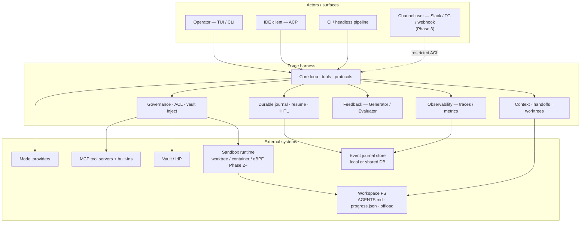

### 2.2 Trust boundaries

Zones and what may cross each edge. Rules table below is normative.

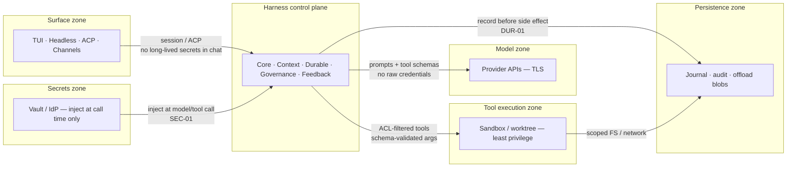

| Boundary | Rule |
|----------|------|
| Client surfaces → harness | Authenticated session; ACP or local process; no secrets stored via UI prompts |
| Harness → model providers | TLS 1.3; credentials injected by gateway/proxy, **never** in model context |
| Harness → MCP / tools | Dynamic ACL filter before tool listing; args schema-validated; audit logged |
| Tool execution → host | Sandbox: non-root, restricted egress; worktree isolation for edits; stronger profiles Phase 2+ |
| Multi-channel gateway → code tools | Least privilege; gateway must not hold broad repo ACLs by default |
| Harness → journal / audit | Append-only intent and results; redaction for secrets in default exports |

### 2.3 Six harness primitives (mapped to modules)

| Primitive | Owning module(s) |
|-----------|------------------|
| Loop control & orchestration | Core loop + Dual-sensor feedback |
| Context engineering & window management | Context & workspace isolation engine |
| State & persistence tracking | Durable execution engine + handoff artifacts |
| Tool lifecycle & protocol routing | Declarative core & universal protocol layer |
| Safety, governance & HITL | Zero-trust governance gateway |
| Observability, verification & feedback | Dual-sensor feedback + OTEL |

---

## 3. Package layout (logical modules)

Five core modules from the PRD, plus thin surface adapters.

| Package / module | Owns | Does not own |
|------------------|------|--------------|
| **`core`** — Declarative core & universal protocol | Tool registration (serde + schemars schemas), MCP client/server bridge, ACP session transport, model client abstraction, agent loop driver | UI widgets, vault backends, eBPF probes |
| **`durable`** — Native durable execution engine | Append-only event journal, step records, replay/recovery, durable HITL wait states, session resume IDs | Prompt text assembly, tool side effects themselves |
| **`context`** — Context & workspace isolation | Token budgeting, payload offload URIs, compaction/reset policy, `progress.json` / `AGENTS.md` handoffs, worktree lifecycle | Long-term enterprise IdP, channel routing |
| **`governance`** — Zero-trust gateway & sandbox | OAuth2 scope evaluation, secret vault injection, tool ACL filter, audit log records, sandbox/eBPF policy hooks | Model selection UX, Evaluator prompts |
| **`feedback`** — Dual-sensor feedback | Generator/Evaluator orchestration, deterministic sensor runners (lint/test), repair task routing | Durable journal storage schema |
| **`surfaces`** — Multi-surface adapters | TUI, headless CLI, ACP IDE adapter, multi-channel gateway adapters, status rendering | Business logic of tools or durability |
| **`obs`** — Observability | OTEL spans/metrics (model, tool, step), SIEM/OTLP export hooks | Business decisions |

### Dependency direction

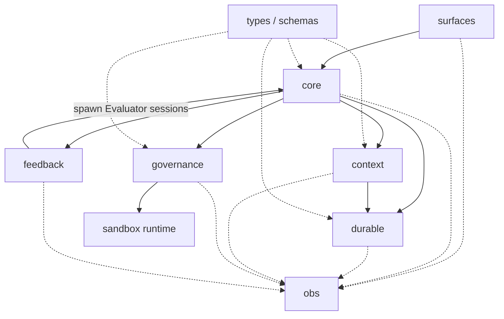

Solid edges are functional dependencies. Dotted edges into `obs` mean modules emit telemetry; `obs` does not own business decisions. Shared types flow outward only.

**Rules:**

1. `surfaces` must not call MCP servers or model APIs directly—only via `core`.  
2. Side effects (tools, model calls) execute only **after** `durable` has journaled the intent (DUR-01).  
3. `governance` is on the tool path: list/filter → authorize → inject secrets → execute → audit.  
4. `context` is the only module that may rewrite conversation payloads for the next model call.  
5. `feedback` may start isolated sessions (clean Evaluator context) through `core`, not by mutating Generator history in place.  
6. No circular imports; shared types live in a thin `types` / schema package.

---

## 4. Core concepts

### 4.1 Session

A **session** is a durable unit of agent work (one interactive chat, one CI job, one channel-originated task).

| Field / concern | Description |
|-----------------|-------------|
| `session_id` | Stable ID for resume across process restarts |
| `surface` | `tui` \| `headless` \| `acp` \| `channel` |
| `model_config` | Provider + model id (single config switch) |
| `workspace_root` | Primary repo / working directory; **defaults to process cwd** if unset |
| `worktree_path` | Optional isolated git worktree path |
| `role` | Generator \| Evaluator \| (future specialized roles) |
| `journal_cursor` | Last committed event sequence number |
| `context_budget` | Token capacity and current usage estimate |
| `acl_principal` | Identity/role/scopes for tool filtering |
| `status` | `running` \| `awaiting_hitl` \| `completed` \| `failed` \| `compacted` |

**Lifecycle:** create → (optional recover from journal) → plan–act–observe loop → terminal state. HITL pauses set `awaiting_hitl` without holding compute (DUR-03).

### 4.2 Tools

| Aspect | Design |
|--------|--------|
| **Contract** | Each tool: name, description, serde/schemars input type, typed output serialization (CORE-01) |
| **Registry** | In-process built-ins + MCP-discovered tools, merged then ACL-filtered (SEC-02) |
| **Built-ins (coding default)** | `read_file`, `write_file`, `bash`, `grep`, **`git`** (allowlisted subcommands: status, diff, log, add, commit, push, …); subject to sandbox and worktree policy |
| **Built-ins (web)** | **`web_search`** — public web query via pluggable backends (`network` class); keys from env/vault only ([web-search-tool.md](./designs/web-search-tool.md)) |
| **MCP** | Stdio/HTTP MCP servers for external integrations (CORE-02) |
| **Validation** | Invalid args → structured error + automatic validation retry prompt to the model |
| **Execution path** | Journal intent → ACL/sandbox → inject credentials → run → journal result → context ingest (or offload) |

### 4.3 LLM stream events (adapter layer)

Normalized events from any provider stream (provider-agnostic):

| Event | Meaning |
|-------|---------|
| `text_delta` | Assistant text chunk |
| `tool_call_start` / `tool_call_delta` / `tool_call_end` | Structured tool invocation |
| `usage` | Token usage (prompt/completion) for budgeting |
| `message_end` | Turn complete |
| `error` | Provider/transport failure |

Adapters map vendor streams → this envelope so `core` and `surfaces` never branch on provider.

**Phase 5:** `LiteLlmModelClient` maps LiteLLM SDK results/streams into the same envelope. The agent loop never imports LiteLLM or branches on vendor strings.

### 4.4 Agent events (UI / surface layer)

Events surfaces consume (may be projected from journal + live stream):

| Event | Meaning |
|-------|---------|
| `session_status` | Status transitions including HITL wait |
| `assistant_delta` | Display streaming text |
| `tool_started` / `tool_finished` | Tool visibility with redacted args |
| `context_lifecycle` | Offload, compaction, or hard reset/handoff |
| `evaluator_report` | Structured failure/repair from Evaluator |
| `trace_link` | Correlation id for OTEL |

### 4.5 Event journal (durable)

Append-only log (SQLite single-node; Postgres multi-instance):

| Record types | Phase | Purpose |
|--------------|-------|---------|
| `session_created`, `user_message`, `model_*`, `tool_*`, `tool_validation_failed`, `state_patch`, `session_status` | **1** | Core journal ([durable-execution.md](./designs/durable-execution.md)) |
| `hitl_wait` / `hitl_resume` | **2** | Durable HITL ([durable-hitl.md](./designs/durable-hitl.md)) |
| `context_reset` | **2** | Handoff ([context-lifecycle.md](./designs/context-lifecycle.md)) |

Envelope + Phase 1 replay: [designs/durable-execution.md](./designs/durable-execution.md).

**Replay rule:** On restart, rebuild in-memory session; for completed `tool_intent`s, return cached `tool_result` without re-execution; do not re-call LLM for completed model steps (DUR-02).

### 4.6 Handoff artifacts

| Artifact | Role |
|----------|------|
| `progress.json` | Machine-readable goal, completed steps, blockers, next actions |
| `AGENTS.md` | Project memory / operator instructions loaded into fresh context |
| Git history / worktree | Authoritative workspace state across resets |

At ~80% context capacity: write handoff → clear active window → re-init with progress + workspace only (CTX-02). Large tool payloads (> configurable token threshold) become file URIs (CTX-01).

### 4.7 Generator vs. Evaluator

| Agent | Context | Tools | Output |
|-------|---------|-------|--------|
| **Generator** | Task + workspace + progress | Implementation tools (edit, bash, etc.) | Artifacts / code changes |
| **Evaluator** | Clean window; criteria + artifact pointers | Lint/test runners, optional browser automation | Structured bug/repair reports |

Harness routes Evaluator failures back to Generator as repair tasks until criteria pass (EVAL-01). Pattern is optional per run config (decaying scaffolding).

---

## 5. Runtime flows

### 5.1 Process bootstrap

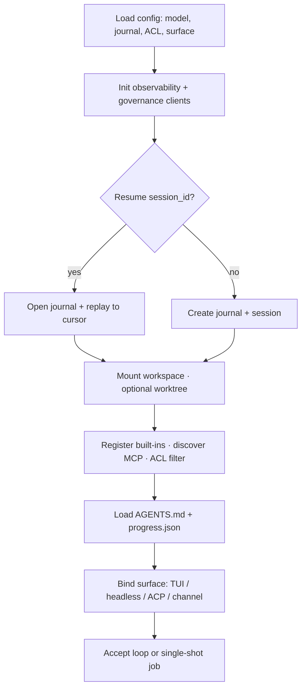

1. Load configuration (model provider switch, journal backend, ACL policy, surface mode).  
2. Initialize OTEL (if enabled), governance clients (vault/IdP when configured).  
3. Open or create event journal; if `session_id` resume → **replay** to restore state.  
4. Mount workspace; optionally create `isolation: worktree`.  
5. Discover MCP tools; apply ACL filter; register built-ins.  
6. Load `AGENTS.md` / last `progress.json` into context assembler.  
7. Bind surface (TUI / headless / ACP / channel) and enter accept-loop or single-shot job.

### 5.2 One user message (happy path)

Interactive operator path (TUI or equivalent). Journal-before-side-effect applies to model and tools (`DUR-01`).

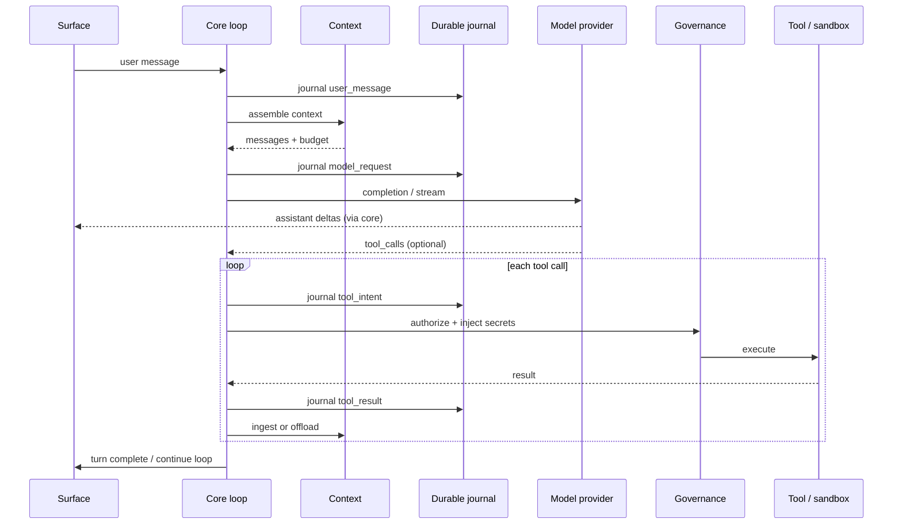

1. Surface submits user message → journal `user_message`.  
2. `context` assembles messages (system + handoff + recent turns + tool refs).  
3. Journal `model_request` → call model via unified client → stream events to surface.  
4. On tool calls: for each tool  
   - journal `tool_intent`  
   - `governance` authorize + inject secrets  
   - execute in sandbox/worktree  
   - journal `tool_result`  
   - `context` ingest or offload  
5. Continue model turns until terminal assistant message or HITL pause.  
6. Emit OTEL spans for model/tool/step; update token budget.

### 5.3 Agent loop (control logic)

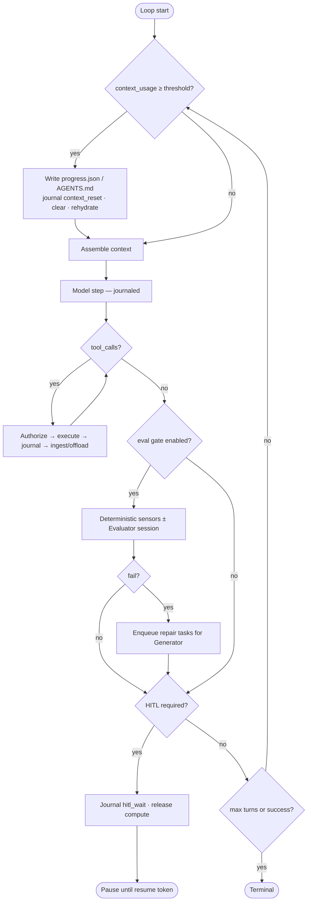

Turn limits, cost caps (`maxTurns`-style), and `disallowedTools` are feedforward constraints applied before model listing/execution.

**Phase 1:** tool calls within a single model turn run **sequentially** (simpler journal ordering). Parallel tool execution is deferred (see [designs/agent-loop.md](./designs/agent-loop.md)).

### 5.4 Crash recovery

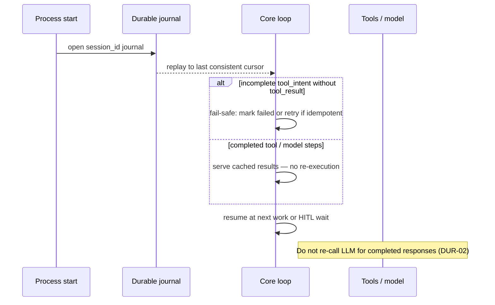

1. Process starts with existing `session_id`.  
2. Replay journal to last consistent cursor.  
3. Incomplete `tool_intent` without `tool_result`: policy is **fail-safe**—do not guess; mark failed or retry only if tool is declared idempotent.  
4. Completed steps: serve cached results; never re-invoke LLM for completed responses.  
5. Resume loop at next pending work or HITL wait.

### 5.5 Durable HITL

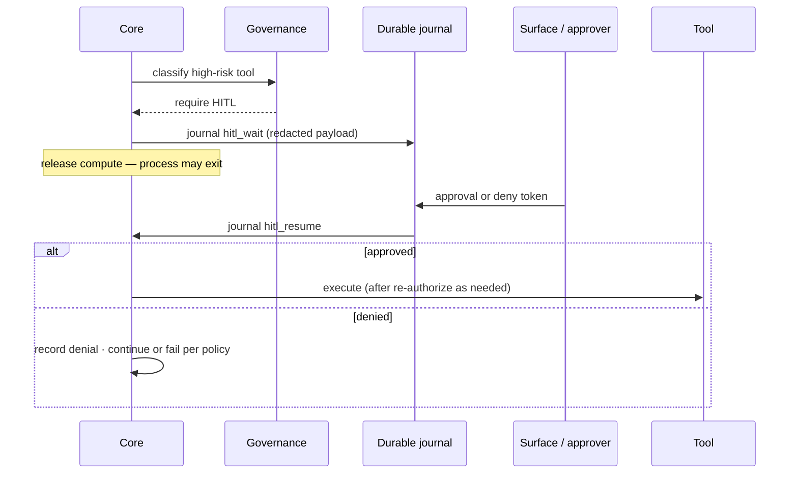

1. High-risk tool classified by policy → journal `hitl_wait` with approval payload (redacted).  
2. Controller process may exit; no busy-wait compute.  
3. Approval token arrives (TUI, ACP, channel, API) → journal `hitl_resume` → continue execution.

### 5.6 Headless CI job

Same core loop; surface is non-interactive. Resume is by `session_id` (and journal path) for interrupted pipelines.

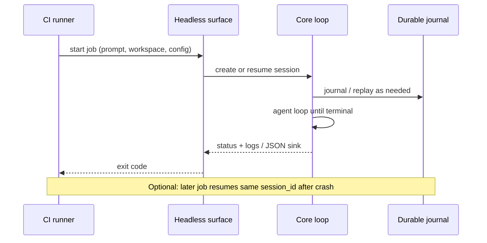

### 5.7 ACP IDE session

IDE is a transport/client only. Loop, journal, tools, and governance stay in the harness (`CORE-02`).

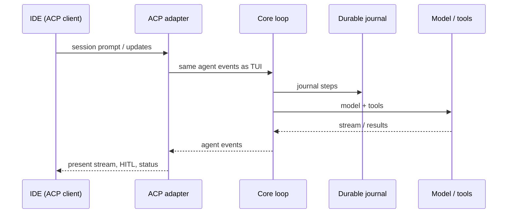

### 5.8 Context reset and handoff

Triggered when usage crosses the configured threshold (default ~80% of capacity) or via explicit `/compact` (`CTX-01`, `CTX-02`).

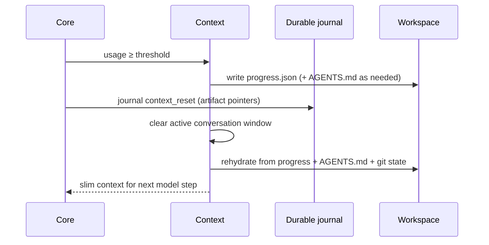

### 5.9 Generator and Evaluator (opt-in)

Default is Generator-only. When enabled, Evaluator runs in an **isolated** session with a clean context (`EVAL-01`).

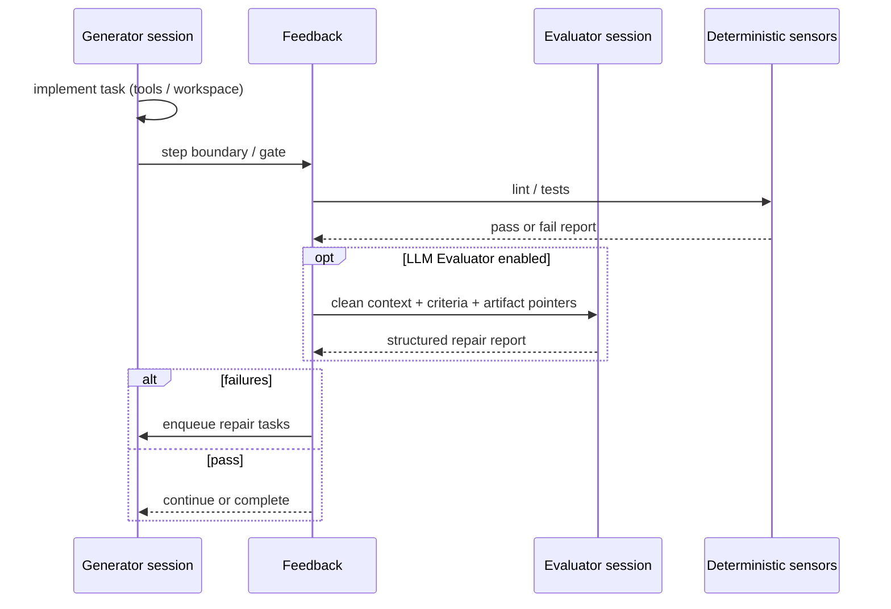

### 5.10 Multi-channel ingress (Phase 3)

Channels map to sessions with **restricted** tool ACLs by default. They must not become an unconstrained repo-execution path.

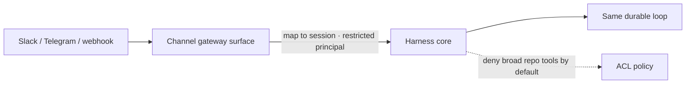

### 5.11 Slash commands / surface-local commands (non-LLM)

Surface-local commands do not hit the model.

- **Phase 1 catalog (canonical):** [designs/tui-commands.md](./designs/tui-commands.md)  
- **Phase 2 commands:** owned by [durable-hitl.md](./designs/durable-hitl.md), [context-lifecycle.md](./designs/context-lifecycle.md), [workspace-isolation.md](./designs/workspace-isolation.md) — not listed in the Phase 1 catalog.

---

## 6. Data model (messages & journal)

### 6.1 Conversation messages (in-context)

| Role | Content |
|------|---------|
| `system` | Assembled: product policy + `AGENTS.md` + runtime constraints |
| `user` | Operator or channel input; may include structured repair tasks |
| `assistant` | Text + tool_call parts |
| `tool` | Result body **or** offload reference URI + short summary |

Messages older than the active window are not re-injected after hard reset; only handoff artifacts + new turns.

### 6.2 Offload blob store

Large tool outputs stored as files (workspace `.forge/offload/` or object store); journal and tool messages hold URIs + hashes + token estimates.

### 6.3 Progress document (schema sketch)

Default path: **`.forge/progress.json`** under the workspace root (configurable). Full rules: [designs/context-lifecycle.md](./designs/context-lifecycle.md).

```json
{
  "version": 1,
  "goal": "string",
  "completed": ["..."],
  "in_progress": "string",
  "blockers": ["..."],
  "next_actions": ["..."],
  "workspace_ref": "git_sha_or_worktree_id",
  "session_id": "…",
  "updated_at": "ISO-8601"
}
```

---

## 7. Project instructions & workspace loading

| Source | When loaded | Use |
|--------|-------------|-----|
| `AGENTS.md` (repo root or configured path) | Session start; post-reset | Standing project memory / operator rules |
| `progress.json` | Resume; post-reset | Task continuity across long horizons |
| Git status / worktree | Each assemble (summarized) | Ground truth of files |
| Surface system overlays | Per surface | TUI vs CI vs channel policy differences |

Discovery order and override rules should be deterministic and documented in config (single root of truth for path globs).

---

## 8. UI / multi-surface architecture

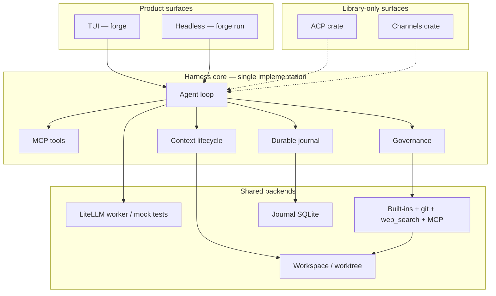

| Surface | Role | Status |
|---------|------|--------|
| **TUI** | Default interactive product (`forge`) | Shipped |
| **Headless** | `forge run`, exit codes, session id | Shipped |
| **Connect** | `forge connect` + `/connect` | Shipped |
| **ACP / channels / fleet / feedback / obs** | Crates for embedders | Library only |

**Principle:** One harness core; product surfaces are TUI + headless. Other adapters may call the same core without re-implementing the loop.

Streaming display rules: tool names + redacted args; never paint secrets; large payloads show URI + summary.

---

## 9. Configuration & credentials

### 9.1 Configuration

| Concern | Mechanism |
|---------|-----------|
| Model provider + model id | Single config key (env/file); no code changes to switch |
| Journal backend | SQLite path or Postgres DSN |
| MCP servers | Declarative list (command/URL) |
| Tool ACLs | Role/scope → allow/deny tool name patterns |
| Context thresholds | Offload token limit; reset at 80% capacity (configurable) |
| Sandbox | Container image, network policy, eBPF profile (Phase 2+) |
| Surfaces | Which adapters to enable |
| Workspace root | Optional; **defaults to process cwd** when omitted |

### 9.2 Credentials

| Rule | Detail |
|------|--------|
| **SEC-01** | Secrets live in vault (or env for dev); gateway injects at tool/model call time |
| Never in context | API keys must not appear in prompts, journal plaintext fields that are model-visible, or OTEL attributes |
| TLS 1.3 | All harness ↔ provider / MCP proxy / sandbox control plane traffic |
| TUI | Does not collect long-lived provider passwords into chat history |

---

## 10. Security architecture

Tool discovery and invocation both pass through governance. Secrets never enter the model-visible context.

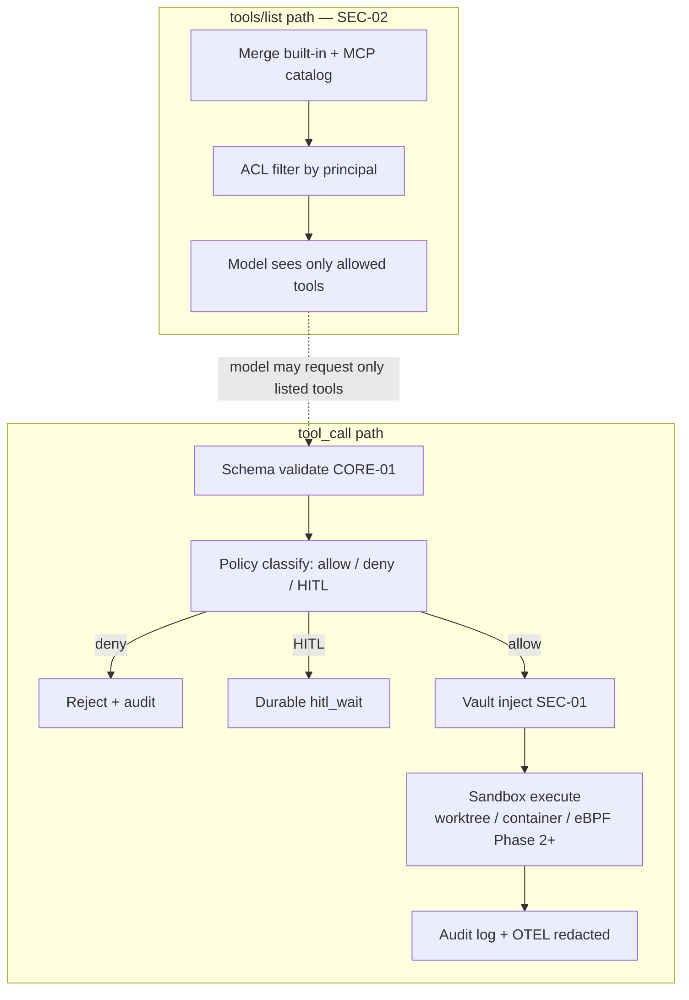

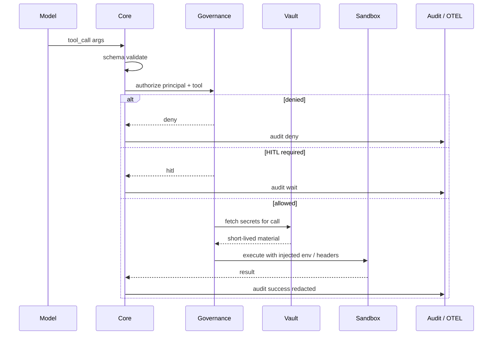

Sandbox defaults (NFR): non-root, restricted egress, read-only root FS. Worktree isolation (CTX-03): file edits in temporary git worktree until merge/discard.

Immutable audit log: tool invocations, arg payloads (redacted), model response metadata, policy decisions; export via OTLP to SIEM (Phase 3).

---

## 11. Observability

| Signal | Content |
|--------|---------|
| OTEL traces | Spans: session step, model call, tool call, context reset, HITL wait (OBS-01) |
| Metrics | Latency, tokens, tool error rates, journal write latency |
| Logs | Structured; correlation with `session_id` + trace id |
| Targets | Harness overhead &lt; 15 ms; journal write &lt; 5 ms; controller &lt; 256 MB/session active |

---

## 12. Testing strategy

| Layer | What |
|-------|------|
| **Unit** | Tool schema (serde/schemars) validation; ACL filter; context budget math; journal append/replay pure logic |
| **Component** | Mock model + mock tools; full loop with journal; crash mid-tool recovery |
| **Integration** | Real MCP server fixture; ACP client smoke; multi-provider smoke (config-only switch) |
| **Security** | Secret redaction tests; deny-list visibility; sandbox egress denial |
| **Long-horizon** | 100+ turn handoff alignment; offload bloat reduction ≥ 80% |
| **Eval quality** | Generator-only vs Generator+Evaluator first-pass quality (EVAL-01 target) |
| **Not mocked away** | Journal durability under kill -9; TLS config in staging |

---

## 13. Cross-cutting decisions

| Decision | Choice | Rationale |
|----------|--------|-----------|
| Primary API style | Flat typed tools + thin loop, not graph DSL | Low abstraction tax; AI-codability; decaying scaffolding |
| Durability | Embedded event journal (LLM-aware) | Temporal-like recovery without losing prompt/tool semantics |
| Context strategy | Offload + hard reset with handoff (prefer over pure summary-only) | Reduce context rot on long tasks |
| Protocols | MCP + ACP both native | Tools vs clients; avoid proprietary lock-in |
| Security | Gateway ACLs + vault inject + sandbox | Enterprise least privilege |
| Surfaces | Adapters over core | One agent process, many UIs |
| Generator/Evaluator | Optional dual session | Avoid self-grading bias; prunable as models improve |
| Model portability | Unified client | Single config switch; stable tools and journal schemas |

---

## 14. Extension points

| Extension | Hook |
|-----------|------|
| New model provider | Prefer LiteLLM model id (Phase 5); Phase 6+ may add a **connect profile** + `/connect` entry without a new client |
| Connect profile | Register profile id, env key names, default models, optional base_url — [connect-command.md](./designs/connect-command.md) |
| New MCP server | Declarative config; tools appear after ACL filter |
| New built-in tool | serde/schemars types + handler; optional policy trait |
| Web search backend | Impl `SearchBackend` + config `provider` id — [web-search-tool.md](./designs/web-search-tool.md) |
| New surface | ACP-compatible client or thin adapter on agent events |
| Custom Evaluator sensors | Register deterministic runners + optional LLM judge profile |
| Policy packs | ACL + HITL classification rules without core changes |
| Journal backend | Storage interface (SQLite ↔ Postgres) |
| Sandbox backend | Container runtime / microVM / eBPF profile provider |

---

## 15. File ↔ responsibility map (target layout)

Illustrative Rust workspace layout (crate names align with §3 / decisions table).

| Path / crate | Responsibility |
|--------------|----------------|
| `forge-core` — loop | Plan–act–observe driver, termination, turn limits |
| `forge-core` — tools registry | Tool registration, serde/schemars validation, dispatch |
| `forge-tools` | Built-ins (`read_file`, `write_file`, `bash`, `grep`, **`git`**, **`web_search`**) + registry |
| `forge-mcp` | MCP discovery/call (product path via config/static demo) |
| `forge-model` | `ModelClient`; **LiteLLM** + test **mock** only |
| `workers/forge-litellm-worker` | LiteLLM **SDK** process (not Proxy) |
| `forge-durable` | Journal + HITL wait records |
| `forge-context` | Budget, offload, handoff, worktree |
| `forge-governance` | ACL, secrets, audit, light sandbox |
| `forge-connect` | Connect profiles + credential store |
| `forge-tui` | Full-screen TUI |
| `forge-cli` | **`forge`** binary: TUI / `run` / `status` / `connect` |
| `forge-acp` | ACP library only |
| `forge-channels` | Channel gateway library only |
| `forge-feedback` | Feedback/evaluator library only |
| `forge-obs` | OTEL helpers library only |
| `forge-fleet` | SCIM/SIEM library only |

---

## 16. Mental model

Forge is the **harness** between models and the real world: a typed tool bus, an event-sourced memory of what already happened, a context window that is deliberately managed (offload and reset, not endless append), and a governance shell that decides what the model is allowed to see and run. Surfaces (TUI, IDE, CI, chat) are interchangeable clients. Reliability comes from journaling before side effects, recovering without double execution, and separating “do the work” (Generator) from “prove the work” (Evaluator)—while keeping the API flat enough that both humans and coding models can extend it without a graph DSL.

---

## Related docs

- PRD: [prd.md](./prd.md)  
- TUI UI reference (screens & workflows): [ui.md](./ui.md)  
- Design docs index (phase-partitioned): [designs/README.md](./designs/README.md)  

---

## Architecture decisions (resolved)

| # | Topic | Decision |
|---|-------|----------|
| 1 | Implementation language | **Rust** |
| 2 | Product shape | **CLI binary** default TUI + headless `run`; not an always-on service |
| 3 | Async runtime | **Tokio** + standard ecosystem (`tracing`, HTTP clients, etc.) |
| 4 | Tool schemas / validation | **serde + schemars** JSON Schema (schema-validated tool I/O) |
| 5 | TUI | **ratatui + crossterm** |
| 6 | Event journal (Phase 1) | **SQLite via sqlx (async)** |
| 7 | Local sandbox default | **Light isolation** (worktree + process/cwd limits); containers for CI/prod profiles |
| 8 | Generator / Evaluator | **Opt-in per task** (single Generator default) |
| 9 | Project memory file | **`AGENTS.md` primary**; optional aliases later |
| 10 | Crate layout | **Workspace monorepo, many crates** aligned to modules in §3 |
| 11 | Model providers (historical) | Native adapters **removed** |
| 18 | Universal providers | **LiteLLM Python SDK only** for production (`stdio` worker). **Not** Proxy. **Mock** for unit/CI env only — **no** product `--mock` flag |
| 19 | Connected providers (Phase 6) | **`/connect`** UX + profiles for **xAI Grok** and **OpenCode Go**. **No** second production `ModelClient`. **6.1:** Grok = **OAuth**; OpenCode Go = **API key with mandatory TUI prompt** |
| 20 | TUI input history (Phase 7) | **Up/Down** navigate submitted command history in main input only; inactive under overlays; session memory required, disk optional |
| 21 | Inline slash (Phase 8) | Main textbox owns `/command` entry + Enter; **do not** auto-open palette on `/`; palette via **Ctrl+K** (or equivalent) |
| 22 | Tab autocomplete + highlight (Phase 8.1) | **Tab** completes highlighted slash suggestion; **↑/↓** move suggestion highlight when panel open; **visible caret**; history recall shows line + caret |
| 23 | Web search tool (Phase 9) | Built-in **`web_search`** with pluggable backends (mock + ≥1 live API); **`network`** side-effect class; keys env/vault only; omit from catalog when disabled/missing key; same journal path as other tools |
| 24 | Always-visible TUI feedback (Phase 10 / TUI-08) | Render feedback strip every frame; dual-write model/session errors to chat banners; never leave critical outcomes only in unrendered fields |
| 25 | Session identity chrome (Phase 10 / TUI-09) | Status chrome shows **provider · model · ctx**; narrow layout keeps identity without sidebar |
| 26 | Activity feed & progressive busy (Phase 10 / TUI-10) | In-session activity ring buffer; busy phases `running · model` / `running · tool:name` |
| 12 | Config | **TOML file + env overrides** (e.g. `forge.toml` / `~/.config/forge/config.toml`; secrets/CI via env) |
| 13 | Protocol phase ownership | **Phase 1 CORE-02 = MCP only.** **Phase 2 CORE-03 = ACP only.** Exclusive; no split ownership of one req ID. |
| 14 | License | **MIT** |
| 15 | Workspace root | **Default to process cwd** when not specified (CLI flag / config optional override) |
| 16 | Handoff progress file | **`.forge/progress.json`** under workspace (configurable) |
| 17 | Tool parallelism (Phase 1) | **Sequential** tool calls within a model turn |

### Rust-specific mapping notes

| PRD / design concept | Rust approach |
|----------------------|---------------|
| Schema-validated tool I/O | `serde::Serialize/Deserialize` + `schemars::JsonSchema` on tool input/output types |
| Type-safe tool registry | Trait objects or enum dispatch + compile-time registered builtins; runtime MCP tools as schema-validated JSON |
| Event journal | Append-only rows in **SQLite via sqlx**; typed event envelope (`serde_json`) with schema version field |
| Unified model client | `async trait` `ModelClient`; Phase 5 production: `LiteLlmModelClient` → worker only; `MockModelClient` for tests |
| LiteLLM (Phase 5) | **Required** for live model calls: **Python** + `litellm`; long-lived worker preferred; **no** proxy server; natives deleted |
| Connect profiles (Phase 6) | Registry + `/connect`; still `LiteLlmModelClient` |
| Connect auth (6.1) | `AuthMode::Oauth` (xAI) vs `AuthMode::ApiKey` + TUI prompt (OpenCode Go); tokens/keys in 0600 store |
| Surfaces | **Product:** `forge` TUI, `forge run`, `status`, `connect`. **Library:** ACP, channels, fleet, feedback, obs |
| Web search | `WebSearchTool` + backends; default offline mock backend |
| TUI visibility | Feedback strip, session chrome, activity feed in `forge-tui` |
| Config | **Optional** TOML + env + flags (no file required) |
| Workspace root | Default **cwd**; override via CLI flag and/or config when specified |
| Observability | `tracing` + OpenTelemetry exporter crates |
| License | MIT |

---

## Open questions

Resolved: `progress.json` path; sequential tools Phase 1; **CORE-02=MCP / CORE-03=ACP**; exclusive phase + design-doc ownership.

| # | Question | Options / notes | Decision |
|---|----------|-----------------|----------|
| 1 | Journal event envelope versioning | Version field on JSON events vs stricter typed migrations | TBD — default lean: `schema_version` on JSON envelope |
| 2 | Exact config path precedence | cwd `forge.toml` vs XDG `~/.config/forge/config.toml` vs flags | TBD |
| 3 | Error type strategy | `thiserror` + `anyhow` at edges vs fully typed errors everywhere | TBD — default lean: `thiserror` in libs, `anyhow` in CLI |
