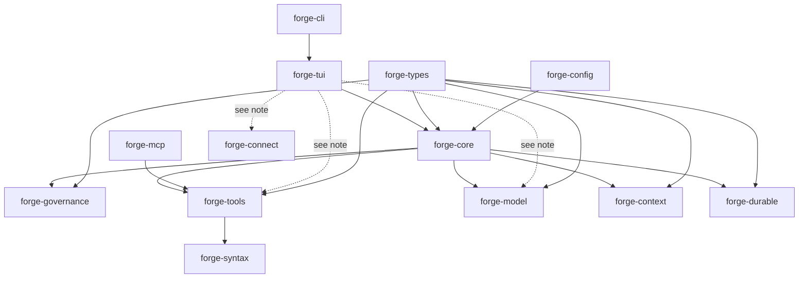
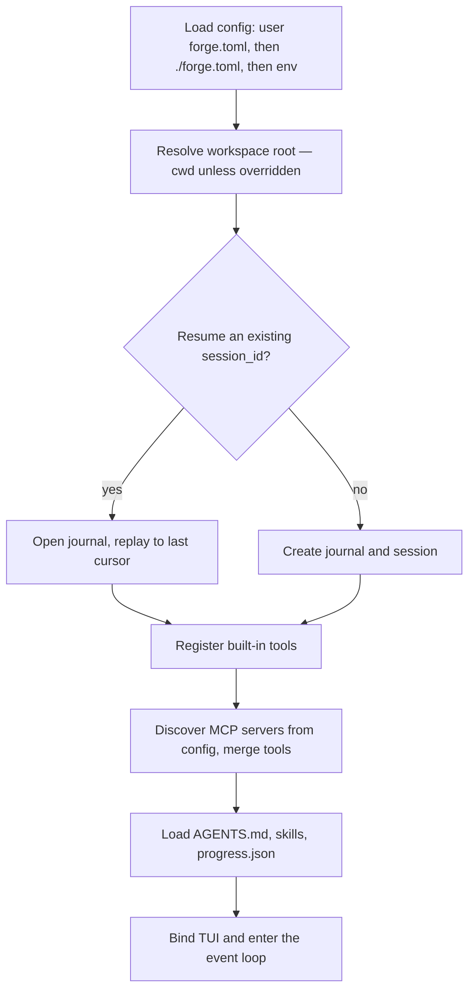
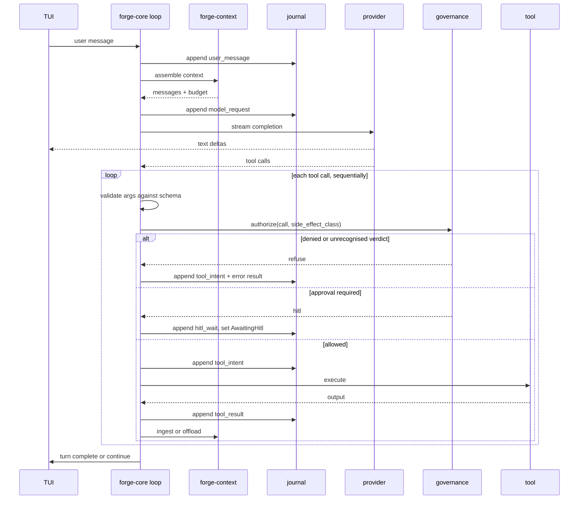

# Forge — Architecture

**Version:** 0.1.0-alpha.10
**Status:** Describes the implementation as it stands. Planned-but-unbuilt work lives in [roadmap.md](./roadmap.md) and is not described here.
**Owner:** Mohit Ranka
**Last updated:** 30 Jul 2026
**Related:** [prd.md](./prd.md) · [ui.md](./ui.md)

> **How to read this document.** It describes what the code does today. Where the
> implementation is partial, that is stated inline rather than smoothed over — see
> [Durability](#7-durability) in particular. Anything not yet built is in
> [roadmap.md](./roadmap.md); if a subsystem is named there and not here, it does
> not exist in the codebase.

---

## 1. What Forge is

Forge is an **AI coding-agent harness**: a plan–act–observe loop, a typed tool bus,
an event-sourced journal, context lifecycle management, a governance gate on the
tool path, and native Rust transports to model providers.

The product surface is a single full-screen terminal application, `forge`, built on
ratatui. There is one binary; the TUI is not optional and there is no daemon.

| Layer | Role |
|-------|------|
| **Model** | External reasoning engine — Anthropic, OpenAI, xAI Grok, OpenCode, Ollama, Codex subscriptions — reached through native HTTP/SSE transports |
| **Harness** | Forge itself: loop, tools, context, journal, governance |
| **Runtime** | The developer's machine. Tool execution is confined to the workspace; there is no container or eBPF isolation |
| **Agent** | Model + harness + runtime, working a task end to end |

### Shipped capability

- Schema-validated tools via `serde` + `schemars`
- Eight built-in tools: `read_file`, `write_file`, `apply_patch`, `bash`, `git`,
  `fffind`, `ffgrep`, `web_search`
- MCP client for stdio/HTTP tool servers, merged into the same registry
- Event-sourced SQLite journal, written before every side effect
- Context budgeting, payload offload, and handoff via `progress.json` / `AGENTS.md`
- Governance gate: ACL filtering, approval prompts, redacted audit records
- `/connect` profiles for API-key and OAuth providers, with a 0600 credential store
- Skills: `SKILL.md` packs discovered from project and global directories

### Explicit non-goals

| Non-goal | Rationale |
|----------|-----------|
| Training or serving models | The harness is scaffolding only |
| Graph or role DSLs as the primary API | Flat typed tool contracts stay AI-codable |
| IDE, chat, or CI adapters | The terminal is the product |
| A second production model client | One native client; the mock is test-only |
| Execution without an audit trail | Tool calls are journaled and audited |

---

## 2. Crate layout

Thirteen crates in one Cargo workspace. Line counts are approximate and included
because the distribution is itself an architectural fact: two thirds of the
codebase is terminal UI.

| Crate | LOC | Internal dependencies | Owns |
|-------|----:|----------------------|------|
| `forge-tui` | 33,189 | config, connect, core, model, syntax, tools, types | Full-screen TUI: chat, overlays, file explorer, diff and source views, model picker, `/connect` flow |
| `forge-connect` | 6,085 | *none* | Provider profiles, credential store, model catalogue, cost lookup, OAuth device flows |
| `forge-tools` | 2,985 | config, search, syntax, types | Built-in tools, the `Tool` trait, registry, workspace path confinement |
| `forge-search` | — | fff-search | Shared workspace index, structured `fffind`/`ffgrep` results, Quick Open backing API |
| `forge-model` | 2,588 | config, types | `ModelClient`; native HTTP/SSE transports and wire normalisation; test mock |
| `forge-core` | 1,884 | config, context, durable, governance, model, tools, types | Agent loop, session lifecycle, tool orchestration |
| `forge-config` | 1,315 | types | `forge.toml` and env loading, provider migration, config trust layers |
| `forge-syntax` | 760 | *none* | Tree-sitter highlighting for diff and code views |
| `forge-durable` | 562 | types | SQLite event journal, append and replay |
| `forge-governance` | 493 | types | ACL, approval policy, argument redaction, audit log |
| `forge-mcp` | 475 | config, tools, types | MCP client and remote tool registration |
| `forge-context` | 444 | types | Token budget, offload, handoff artefacts, skills loading |
| `forge-types` | 372 | — | Shared session, tool, message and journal types |
| `forge-cli` | 200 | 8 crates | The `forge` binary: startup wiring only |

### Dependency direction



The graph is acyclic. `forge-types` is a thin shared vocabulary — 372 lines, no
dependencies of its own — and everything except `forge-connect` and `forge-syntax`
uses it.

**Two things about this graph are worth stating plainly rather than leaving to be
discovered:**

**`forge-tui` reaches past `forge-core`.** It depends directly on `forge-tools`,
`forge-model` and `forge-connect` (the dotted edges above). The `forge-connect`
dependency is live in production code (provider connect and model-catalog flows);
`forge-tools` and `forge-model` are currently pulled in only for test scaffolding
(`ToolRegistry`, `MockModelClient`) inside `forge-tui`'s own `#[cfg(test)]` modules.
Nothing in the production path builds `ModelRequest` values or calls a tool directly
outside the agent loop's governance gate — **the governance gate is a chokepoint for
all tool calls**, not just model-initiated ones. See [§6](#6-governance).

**`forge-connect` shares no types.** It is the only substantial crate with zero
internal dependencies, not even `forge-types`. It hands credentials to
`forge-model` as environment-variable pairs rather than through a typed interface,
so the coupling between the two is by string agreement and is not checked by the
compiler. The reason is the sync/async split described in [§9](#9-the-syncasync-split).

---

## 3. Core concepts

### Session

A session is one durable unit of agent work, backed by its own SQLite journal at
`.forge/sessions/{uuid}.db`.

| Field | Meaning |
|-------|---------|
| `session_id` | Stable UUID; the journal filename |
| `workspace_root` | Working directory; defaults to process cwd |
| `status` | `Running` \| `AwaitingHitl` \| `Completed` \| `Failed` \| `Cancelled` \| `Interrupted` |
| `messages` | Active conversation window |
| `pending_hitl` | Set while a tool call awaits approval |

Task status is semantic session state, not inferred from transcript text. On reload,
terminal states replay from the journal; a stale `Running` session with no live
executor becomes `Interrupted` rather than appearing to still be working.

### Tools

Every tool implements one trait in `forge-tools`:

```rust
trait Tool {
    fn name(&self) -> &str;
    fn description(&self) -> &str;
    fn input_schema(&self) -> serde_json::Value;   // schemars-generated
    fn side_effect_class(&self) -> SideEffectClass;
    fn idempotent(&self) -> bool;
    async fn call(&self, ctx: &ToolContext, args: Value) -> Result<ToolOutput, ToolError>;
}
```

Registration is a single `HashMap` insert keyed on `name()`, so adding a built-in
means implementing the trait and pushing it into `default_builtins()`. There is no
central enum to update and no per-tool rendering code in the TUI — tool calls render
generically by name.

**Paths are confined structurally.** `ToolContext` resolves any tool-supplied path
for read or write, canonicalising it and rejecting anything that escapes the
workspace root — which closes symlinked-ancestor escapes, not just `../` — and
writes into `.git` are refused outright.

`idempotent` is declared on every tool but is **not currently consulted** by
crash recovery; see [§7](#7-durability).

### Model stream events

Provider streams normalise to one envelope so neither the loop nor the UI branches
on vendor: `text_delta`, `tool_call_start` / `_delta` / `_end`, `usage`,
`message_end`, `error`. `NativeModelClient` routes a provider/model id into the
OpenAI-compatible, Anthropic Messages, or Codex Responses transport.

### Journal

Append-only SQLite via `sqlx`. Event types, all present in
`forge_types::JournalEventType`: `SessionCreated`, `UserMessage`, `ModelRequest`,
`ModelResponse`, `ToolIntent`, `ToolResult`, `ToolValidationFailed`, `StatePatch`,
`SessionStatus`, `HitlWait`, `HitlResume`, `ContextReset`.

Rows carry a `schema_version` column. It is written as `1` and is not yet branched
on during replay — the field exists so a future layout change can gate parsing, but
today it is inert.

---

## 4. Process bootstrap



Config load order is user-level, then auto-discovered project `forge.toml`, then
environment overrides — with the trust distinction in [§8](#8-configuration-and-credentials).

---

## 5. One user message



Tool calls within a turn run **sequentially**; parallel execution is not
implemented. At roughly 80% of context capacity the loop writes handoff artefacts,
journals a `context_reset`, clears the window, and rehydrates from
`progress.json` + `AGENTS.md` + git state.

---

## 6. Governance

Every **model-initiated** tool call passes `forge-governance` before execution:
list filtering, authorisation, argument redaction, audit record.

```
tools/list   →  ACL filter by tool name          →  model sees allowed tools only
tool_call    →  schema validate                  →  reject invalid args, retry prompt
             →  authorize(call, side_effect_class)
                   Deny / unrecognised  →  refuse + audit
                   Hitl                 →  journal hitl_wait, release the turn
                   Allow                →  execute
             →  audit with redacted arguments
```

**What the gate does today, stated precisely:**

- **The ACL matches on tool name.** `is_allowed` takes a `Principal` and a
  `SideEffectClass` but currently uses neither; it evaluates name patterns, last
  matching rule winning.
- **The default policy is permissive.** `Governance::default()` installs
  `AclPolicy::allow_all()`. For a single-user local tool that is the appropriate
  default, and no production code path installs a restrictive ACL.
- **The shell tool always prompts.** `bash` is in the default approval set, and
  approval does not depend on the command text. An earlier version exempted it
  unless the command matched one of two literal substrings, which was not a sound
  basis for the decision — textually different spellings of the same command were
  not recognised. Risk heuristics belong in how a prompt is *presented*, never in
  whether one is shown.
- **Unrecognised verdicts refuse.** The denial path is the wildcard arm, so a policy
  decision this build does not understand cannot fall through to execution.
- **Arguments are redacted in audit records and in the UI.** Keys whose names
  contain `key`, `token` or `secret` are replaced before rendering or logging.

**What the gate does not do.** It is not on the path of TUI-initiated tool calls
(see [§2](#2-crate-layout)), there is no sandbox or process isolation beyond
workspace path confinement, and no vault integration — credentials come from the
environment or the local store.

---

## 7. Durability

The write path is complete. The recovery path is partially implemented, and the
distinction matters because recovery code only runs when something has already
gone wrong.

| Guarantee | State |
|-----------|-------|
| Journal the intent before any side effect | **Implemented.** The append is awaited before both the model call and the tool call, and a journal failure propagates, aborting the side effect |
| Journal is load-bearing, not best-effort | **Implemented.** Session creation fails if the journal cannot be opened; there is no degraded mode and no disable flag |
| All documented event types exist | **Implemented** |
| Replay serves cached tool results instead of re-executing | **Implemented.** `journaled_tool_results` is restored on resume; `run_one_tool` serves journaled results via `try_serve_journaled_tool` instead of re-running |
| Crash recovery marks incomplete intents failed, or retries when idempotent | **Implemented.** `reconcile_incomplete_intents` on resume writes a synthetic failure for non-idempotent tools and re-executes idempotent ones whose intent was journaled without a result |
| HITL survives a process restart | **Partial.** `hitl_wait` / `hitl_resume` are journaled and replay restores `AwaitingHitl` with its payload, but `resolve_hitl` takes an in-process decision. There is no out-of-process path for an approval to arrive, so this is journaled in-process approval rather than approval that outlives the controller |
| Schema versioning | **Present but inert.** The column is written and read but never branched on |

---

## 8. Configuration and credentials

### Trust layers

A project `forge.toml` is discovered from the working directory, so it arrives with
a repository rather than from a deliberate act by the user. Cloning a repository
must not be enough to redirect credentialed requests or to spawn processes.
Configuration therefore has two scopes:

| Scope | Source | Privileged keys |
|-------|--------|-----------------|
| **Trusted** | User-level config, or a path named explicitly with `--config` | Honoured |
| **Untrusted project** | Auto-discovered `./forge.toml` | Refused, and the refusal is surfaced |

Keys that grant code execution or redirect credentialed traffic are the ones
refused from the untrusted layer.

### On-disk formats

| Path | Contents |
|------|----------|
| `forge.toml` | Model provider and id, journal location, MCP servers, TUI preferences, tool settings |
| `~/.config/forge/credentials.toml` | API keys and OAuth tokens, written 0600 |
| `.forge/sessions/{uuid}.db` | Event journal |
| `.forge/progress.json` | Handoff document |
| `.forge/offload/` | Large tool payloads, referenced from the transcript by URI |

### Credential rules

- Secrets come from the environment or the local store; they are injected at call
  time and never placed in model-visible context.
- The credential file is written 0600 and its permissions are checked on read.
- Errors, audit records and the TUI never render a credential; verification
  failures report status codes, not keys.

---

## 9. The sync/async split

`forge-connect` uses **`ureq`** and is entirely synchronous. Everything else that
speaks HTTP — `forge-model`, `forge-mcp` — uses `reqwest` on Tokio.

This is deliberate and load-bearing. `forge-connect`'s work happens in synchronous
contexts: TUI event callbacks and spawned OS threads. `reqwest::blocking` **panics
when constructed inside a Tokio runtime**, which is exactly where those calls
originate, so the manifest carries the constraint next to the dependency:

```toml
# Sync HTTP only — never reqwest::blocking (panics inside tokio async TUI/CLI).
ureq = { workspace = true }
```

Two HTTP clients in one workspace looks like duplication and is routinely proposed
for consolidation. **It is not duplication.** Merging the two would force
credential verification and catalogue refresh into async code, or wrap every call
in `spawn_blocking`. Any change here has to keep the sync boundary intact.

The synchronous work that must not block the render loop is moved to OS threads and
polled without blocking: results return over a channel read with `try_recv`, and the
event loop idles on a bounded `event::poll` rather than spinning.

---

## 10. Observability

`tracing` is used for structured logging in five crates. There is **no OpenTelemetry
integration** — no exporter, no spans, no metrics pipeline; see
[roadmap.md](./roadmap.md).

---

## 11. Testing and CI

Two workflows, both on Rust 1.97.1, which is also the MSRV in `Cargo.toml`:

| Workflow | Gates |
|----------|-------|
| **CI** — on push to `main`, every PR | `cargo fmt --all -- --check` · `cargo clippy --workspace --all-targets --locked -- -D warnings` · `cargo test --workspace --all-targets --locked` |
| **Audit** — weekly | `cargo audit` against the RustSec advisory database |

Advisory handling is configured rather than ad hoc: `deny.toml` records triaged
dependency advisories, Dependabot proposes updates, and `SECURITY.md` gives a
private disclosure path — which matters for a public repository where filing a
vulnerability as an issue would be the disclosure.

Roughly 880 tests, spanning tool schema validation, ACL evaluation, context budget
arithmetic, journal append and replay, full loop runs against the mock model, path
confinement, and rendered-output assertions for the TUI.

**The suite is not fully hermetic.** Some tests read process-global state. Provider
credentials in particular: validate with them stripped.

```sh
env -u ANTHROPIC_API_KEY -u OPENAI_API_KEY -u XAI_API_KEY \
    -u OPENCODE_API_KEY -u OLLAMA_HOST -u FORGE_CODEX_ACCESS_TOKEN \
  cargo test --workspace --all-targets --locked
```

Where a process-global race has been found, the established fix is a static mutex
guard around the affected tests rather than serialising the whole suite.

---

## 12. Extension points

| Extension | What it takes |
|-----------|---------------|
| **New built-in tool** | Implement `Tool`, push it into `default_builtins()`. One crate, no central enum, no UI work. Consider whether it should require approval — that is not inferred |
| **New MCP server** | Declarative config entry; its tools join the registry and are ACL-filtered |
| **New web-search backend** | Implement `SearchBackend`, select it by config id |
| **New model provider** | A `ConnectProfile` for auth and catalogue, plus a transport route in `forge-model`. Costlier than it looks: several sites dispatch on provider-id strings with catch-all arms, so a missed edit compiles and fails at runtime |
| **Journal backend** | Not pluggable. `SqlitePool` is concrete and there is no storage trait |

---

## 13. Resolved decisions

| Topic | Decision |
|-------|----------|
| Language | Rust, MSRV 1.97.1 |
| Product shape | Single CLI binary, full-screen TUI, no daemon |
| Async runtime | Tokio, plus synchronous `ureq` in `forge-connect` (§9) |
| Tool schemas | `serde` + `schemars` JSON Schema |
| TUI | ratatui + crossterm |
| Journal | SQLite via `sqlx`; the build enables the `sqlite` feature only |
| Local isolation | Workspace path confinement. No container, no eBPF |
| Project memory | `AGENTS.md` |
| Handoff document | `.forge/progress.json` |
| Tool parallelism | Sequential within a turn |
| Config | TOML plus env overrides; no file required; project config is untrusted |
| Model providers | Native Rust transports only; mock is test-only, gated at runtime by config |
| Error strategy | `thiserror` in libraries, `anyhow` confined to `forge-cli` |
| Public enums | `#[non_exhaustive]` on embedder-facing enums so added variants are not breaking |
| License | MIT |

---

## 14. Mental model

Forge is the harness between a model and a real machine: a typed tool bus, an
event-sourced record of what already happened, a context window that is managed
rather than endlessly appended, and a gate that decides what the model may run.
Reliability comes from journaling intent before acting, and from refusing by
default when a decision is not understood.

The honest summary of where it stands: the write path and the tool contract are
solid, the recovery path is scaffolded rather than finished, and two thirds of the
code is the terminal interface.
