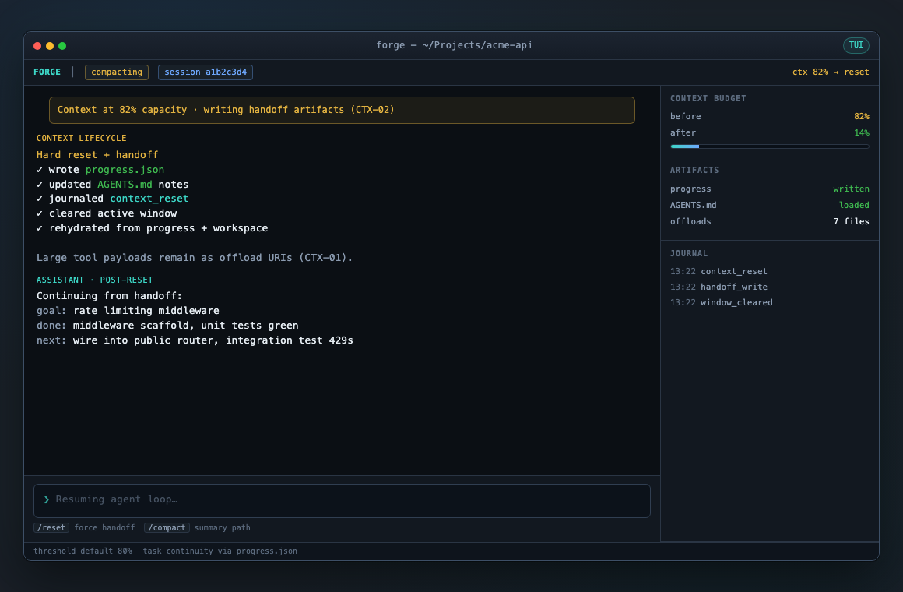
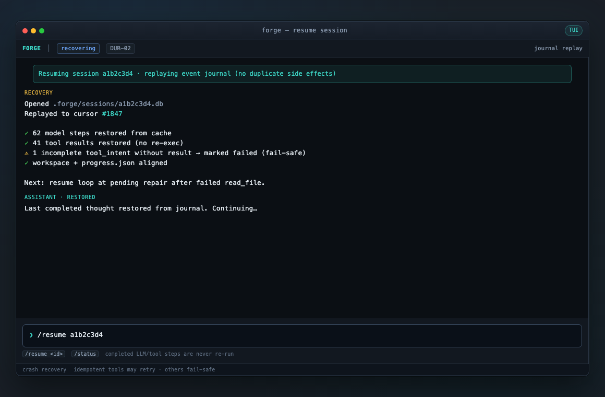
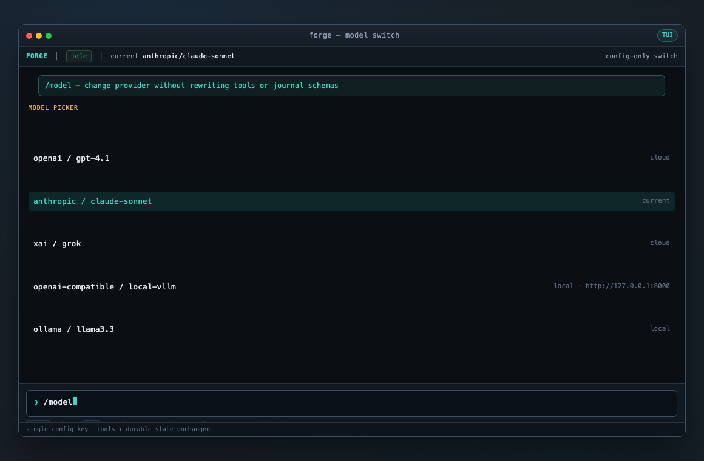
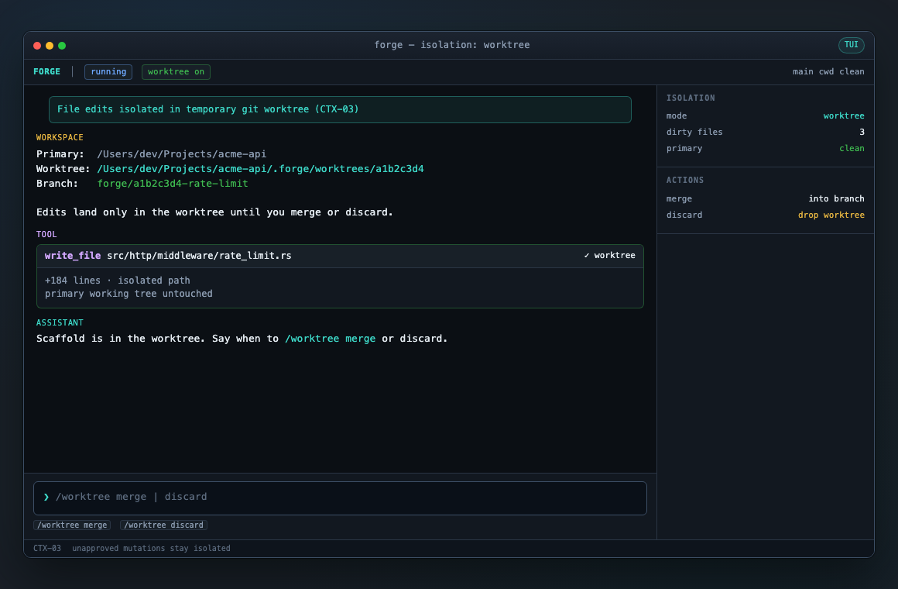
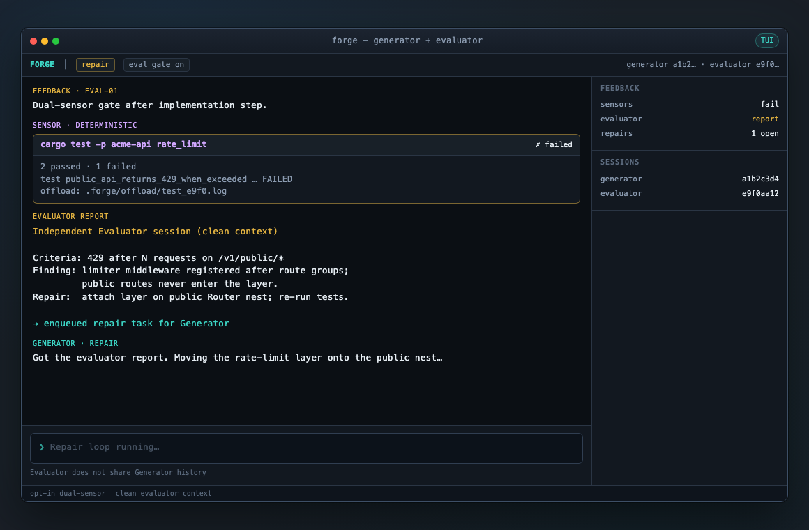
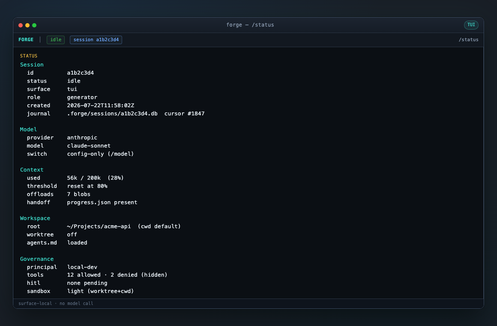
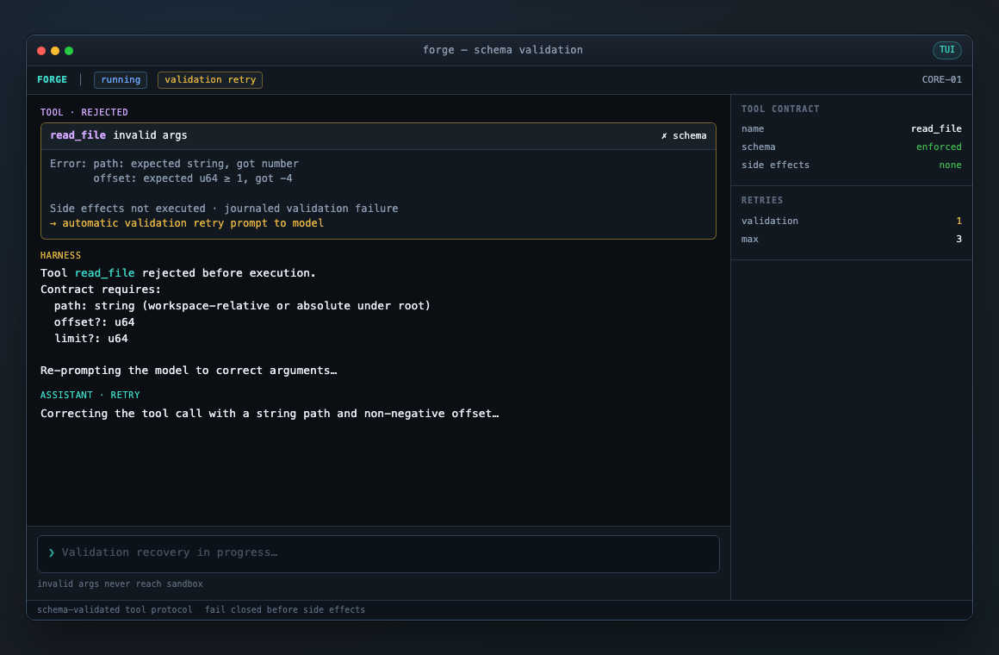

# Forge — TUI UI reference

**Version:** 0.5  
**Status:** Draft mockups — Phase 4 base; Phase 8 / 8.1 input; **Phase 10 operator visibility**  
**Owner:** Mohit Ranka  
**Last updated:** 23 Jul 2026  
**Related:** [prd.md](./prd.md) · [architecture.md](./architecture.md) · [designs/README.md](./designs/README.md) · Phase 4 TUI designs · Phase 8: [tui-slash-inline](./designs/tui-slash-inline.md) · [tui-slash-autocomplete](./designs/tui-slash-autocomplete.md) · Phase 10: [tui-status-feedback](./designs/tui-status-feedback.md) · [tui-session-chrome](./designs/tui-session-chrome.md) · [tui-activity-feed](./designs/tui-activity-feed.md)

---

## Purpose

Visual reference for the **full-screen terminal TUI** surface (`forge` / ratatui). Mockups are **Phase 4 design targets** (see [architecture.md](./architecture.md) Phase 4), not screenshots of a shipped binary. Phases 1–3 may use line-mode `repl` / headless; Phase 4 owns the ratatui app.

| Asset | Path |
|-------|------|
| Rendered screens | [`ui/images/`](./ui/images/) |
| Editable HTML sources | [`ui/screens/`](./ui/screens/) |
| Shared chrome CSS | [`ui/screens/styles.css`](./ui/screens/styles.css) |

To re-render PNGs after HTML edits:

```bash
CHROME="/Applications/Google Chrome.app/Contents/MacOS/Google Chrome"
SCREENS="docs/ui/screens"
OUT="docs/ui/images"
for f in "$SCREENS"/*.html; do
  base="$(basename "${f%.html}")"
  "$CHROME" --headless=new --disable-gpu --hide-scrollbars \
    --window-size=1160,760 \
    --screenshot="$OUT/${base}.png" \
    "file://$(cd "$(dirname "$f")" && pwd)/$(basename "$f")"
done
```

---

## Design language

| Element | Intent |
|---------|--------|
| **Status bar** | Brand, status pill (incl. progressive busy), session id, **provider · model**, context % (threshold colors), worktree; optional profile/search (Phase 10) |
| **Main chat** | User / assistant / system / tool cards; streaming cursor; **error banners** for model/system failures (Phase 10) |
| **Sidebar** | Session metadata, context meter, ACL summary; **ACTIVITY feed** (Phase 10) |
| **Feedback strip** | Always-visible latest status/error line between chat and input (Phase 10 / TUI-08) |
| **Notices** | Multi-line help / connect lists above feedback when needed |
| **Input** | `❯` prompt; **visible caret**; type `/command` inline (Phase 8); key hints (`Tab` complete · `Ctrl+K` list · `↑↓` history/suggest) |
| **Slash suggestions** | Panel above input while typing `/…` (Phase 8.1); **one row highlighted**; Tab applies |
| **Modals / palette** | HITL approval; full command palette (Ctrl+K); connect OAuth/API-key overlays |
| **Color cues** | Teal accent (forge), blue info, amber warn/HITL, red deny/error, green ok; **highlight = brand bold / reverse**; ctx gauge warn/danger thresholds |
| **Security UX** | Redact secrets; show tool names + safe args; offload large payloads as URIs; do not autocomplete secrets; no keys in feedback/activity |

**Chrome note:** Window traffic lights are mock presentation only. The real TUI is full-terminal (ratatui), not an embedded app window—layout regions map 1:1 to terminal panels.

---

## Screen index

| # | Screen | Workflow | Image |
|---|--------|----------|-------|
| 01 | Home / idle | Session start | [01-home](./ui/images/01-home.png) |
| 02 | Chat streaming | Operator message happy path | [02-chat-streaming](./ui/images/02-chat-streaming.png) |
| 03 | Tool execution | Tool path + journal | [03-tool-execution](./ui/images/03-tool-execution.png) |
| 04 | HITL approval | Durable human-in-the-loop | [04-hitl-approval](./ui/images/04-hitl-approval.png) |
| 05 | Context handoff | Budget threshold reset | [05-context-handoff](./ui/images/05-context-handoff.png) |
| 06 | Session resume | Crash recovery | [06-session-resume](./ui/images/06-session-resume.png) |
| 07 | Slash commands | Surface-local commands | [07-slash-commands](./ui/images/07-slash-commands.png) |
| 08 | Model switch | Config-only provider change | [08-model-switch](./ui/images/08-model-switch.png) |
| 09 | Worktree isolation | Isolated file edits | [09-worktree](./ui/images/09-worktree.png) |
| 10 | Evaluator report | Generator / Evaluator gate | [10-evaluator-report](./ui/images/10-evaluator-report.png) |
| 11 | Session status | `/status` | [11-session-status](./ui/images/11-session-status.png) |
| 12 | Validation error | Schema reject + retry | [12-error-validation](./ui/images/12-error-validation.png) |
| **13** | **Slash autocomplete** | Phase **8.1** Tab + highlight | ASCII wireframe below (PNG optional) |
| **14** | **History recall** | Phase 7 + caret | ASCII wireframe below |
| **15** | **Session chrome + feedback** | Phase **10** TUI-08/09 | ASCII wireframe below |
| **16** | **Activity + rate-limit error** | Phase **10** TUI-08/10 | ASCII wireframe below |

---

## Workflows and screens

### 1. Session start — home / idle

**When:** Process bootstrap complete; workspace and `AGENTS.md` loaded; waiting for input.  
**Architecture:** §5.1 bootstrap · §8 TUI surface.


**UI requirements**

- Show workspace path, session id, model, context budget, worktree flag  
- Sidebar: session, budget meter, ACL tool counts, journal tail  
- Empty-state prompt; `/` discovers commands  

---

### 2. Operator chat — streaming response

**When:** User message submitted; model stream in progress (`text_delta`).  
**Architecture:** §5.2 happy path.


**UI requirements**

- Status `running`; turn counter; token usage while streaming  
- Interrupt affordance (`Esc` / `Ctrl+C`)  
- Input disabled or dimmed during stream  

---

### 3. Tool execution

**When:** Model emits tool calls; harness journals intent, authorizes, executes, journals result.  
**Architecture:** §5.2 · §10 tool path · CORE-01 / DUR-01.


**UI requirements**

- Tool cards: name, safe args summary, running vs done  
- Large outputs → short summary + offload URI (CTX-01)  
- Sidebar reflects validate → ACL → HITL → vault path  
- Never render raw vault secrets  

---

### 4. Durable HITL approval

**When:** Policy classifies a tool as high-risk; session enters `awaiting_hitl`.  
**Architecture:** §5.5 · DUR-03.


**UI requirements**

- Modal: tool, redacted args, risk reason, Approve / Deny  
- Status pill `awaiting_hitl`; “compute released”  
- Also operable via `/approve` · `/deny` after process restart  

---

### 5. Context budget handoff reset

**When:** Usage crosses threshold (default ~80%) or user runs `/reset`.  
**Architecture:** §5.8 · CTX-01 / CTX-02.



**UI requirements**

- Banner for lifecycle event  
- Confirm `progress.json` / `AGENTS.md` write + journal `context_reset`  
- Show before/after budget; rehydrated goal / next actions  

---

### 6. Crash recovery / session resume

**When:** Operator runs `/resume <session_id>` or process restarts with existing journal.  
**Architecture:** §5.4 · DUR-02.



**UI requirements**

- Replay progress: restored model/tool caches, fail-safe incomplete intents  
- Explicit copy: completed steps are **not** re-executed  
- Clear next action after recovery  

---

### 7. Slash command palette

**When:** **Ctrl+K** (Phase 8) opens the full discovery palette. Typing `/` in the main textbox does **not** force this modal (Phase 8).  
**Architecture:** §5.11 · Phase 8 [tui-slash-inline](./designs/tui-slash-inline.md).  
**Phase 1 catalog:** [designs/tui-commands.md](./designs/tui-commands.md). Phase 2+ commands live in their phase design docs (HITL, context, worktree).


**Commands (mockup shows a representative subset; full catalog is the design doc)**

| Command | Purpose |
|---------|---------|
| `/resume` | Resume session by id |
| `/compact` | Force handoff + clear context |
| `/status` | Session, budget, journal cursor, and token usage |
| `/model` | Switch provider/model (config only) |
| `/approve` / `/deny` | HITL decision |
| `/journal` `/quit` | Additional commands in design catalog |
| `/connect` | Phase 6 provider connect |

The HTML palette mockup (`07-slash-commands`) may omit newer commands until re-rendered; behavior is defined only by [tui-commands.md](./designs/tui-commands.md).

---

### 13. Slash autocomplete (Phase 8.1)

**When:** Operator types a slash prefix in the **main input** (e.g. `/sta`).  
**PRD:** TUI-07 · [tui-slash-autocomplete.md](./designs/tui-slash-autocomplete.md).

```text
┌ status  FORGE · idle · model · ctx% ─────────────────────────────────────┐
├ conversation ─────────────────────────────┬ sidebar ─────────────────────┤
│ …                                         │ …                            │
│                                           │                              │
┌ suggestions · Tab complete · ↑↓ ──────────┴──────────────────────────────┐
│ ▶ /status      Session status          ← highlighted selection           │
│   /tools       List tools                                                │
└──────────────────────────────────────────────────────────────────────────┘
┌ input ───────────────────────────────────────────────────────────────────┐
│ ❯ /sta█                                 ← caret (block / reverse video)  │
└──────────────────────────────────────────────────────────────────────────┘
│ footer: version · cwd · Tab complete · Ctrl+K list · ↑↓ suggest/history  │
```

**UI requirements**

- One **highlighted** suggestion row (teal/brand bold or reverse).  
- **Tab** applies highlight into the textbox.  
- **↑/↓** move highlight (not chat scroll).  
- Input **caret** always visible when focused.  
- Panel hidden when a modal overlay is open.

---

### 14. History recall with caret (Phase 7 + 8.1)

**When:** Operator presses **↑** with a non-slash draft (or after leaving suggest mode).  
**PRD:** TUI-05 · TUI-07.

```text
┌ input ───────────────────────────────────────────────────────────────────┐
│ ❯ /connect list█                        ← recalled line + caret at end   │
└──────────────────────────────────────────────────────────────────────────┘
```

**UI requirements**

- Recalled text fills the input; caret at end.  
- Optional muted status: `history 2/10`.  
- **↓** walks toward the live draft.

---

### 15. Session chrome + feedback strip (Phase 10)

**When:** Idle or mid-session; operator needs ambient identity and last system line.  
**PRD:** TUI-08 · TUI-09 · [tui-session-chrome.md](./designs/tui-session-chrome.md) · [tui-status-feedback.md](./designs/tui-status-feedback.md).

```text
┌─ FORGE │ idle │ sess a1b2c3d4 │ litellm · xai/grok-3 │ ctx 34% │ wt off ─┐
│ chat …                                                                   │
│                                                                          │
│ (notices optional)                                                       │
├─ feedback: Connected xai · model xai/grok-3 ────────────────────────────┤
├─ ❯ █ ────────────────────────────────────────────────────────────────────┤
│ 0.12.0  cwd ~/proj  │ /help · Esc · Ctrl+C                               │
└──────────────────────────────────────────────────────────────────────────┘
```

**UI requirements**

- Status shows **provider · model** together (not only model on status and provider on footer).  
- Context % with warn/danger color thresholds (≥70% / ≥90%).  
- Feedback strip always shows latest non-empty `status_message` / feedback.  
- Narrow (&lt;80 cols): sidebar may hide; **model + ctx remain** on status.  
- Optional second status tokens: connect profile, web search backend, tool count.

---

### 16. Activity feed + rate-limit error (Phase 10)

**When:** Model call fails (e.g. HTTP 429) or multi-step turn runs tools.  
**PRD:** TUI-08 · TUI-10 · [tui-activity-feed.md](./designs/tui-activity-feed.md).

```text
┌─ FORGE │ idle │ … │ litellm · grok │ ctx 34% │ wt off ───────────────────┐
│ YOU                                                                      │
│   summarize latest serde docs                                            │
│                                                                          │
│ ┌ error ───────────────────────────────────────────────────────────────┐ │
│ │ Model error: rate limited (HTTP 429). Wait and retry, or /model.     │ │
│ └──────────────────────────────────────────────────────────────────────┘ │
│                                              │ ACTIVITY                  │
│                                              │ 12:04 model call started  │
│                                              │ 12:05 model error · 429   │
├─ ! Model error: rate limited (HTTP 429). Wait and retry, or /model. ────┤
├─ ❯ █ ────────────────────────────────────────────────────────────────────┤
│ footer …                                                                 │
└──────────────────────────────────────────────────────────────────────────┘
```

**UI requirements**

- Chat **error banner** durable in scrollback.  
- Feedback strip repeats short error (severity).  
- Sidebar ACTIVITY lists chronological steps (wide layout).  
- Progressive busy while waiting: status pill `running · model` (or `running · tool:web_search`).  
- No API keys or secrets in any of the three surfaces.

---

### 8. Model switch

**When:** `/model` — provider change without rewriting tools or journal schemas.  
**Architecture:** §9 config · multi-provider portability.



**UI requirements**

- List configured providers (cloud + local)  
- Highlight current; no API keys collected in chat  

---

### 9. Worktree isolation

**When:** File edits run with `isolation: worktree`.  
**Architecture:** §5 / CTX-03.



**UI requirements**

- Show primary root vs worktree path and branch  
- Badge that primary tree stays clean  
- `/worktree merge` · `/worktree discard`  

---

### 10. Generator + Evaluator report

**When:** Opt-in evaluation gate after an implementation step.  
**Architecture:** §5.9 · EVAL-01.



**UI requirements**

- Deterministic sensor results + independent Evaluator findings  
- Repair tasks clearly routed back to Generator  
- Distinct session ids for generator vs evaluator  

---

### 11. Session status

**When:** `/status` — no model call.  
**Architecture:** session concept §4.1.



**UI requirements**

- Compact dump: session, model, context, workspace, governance, observability  

---

### 12. Schema validation failure + retry

**When:** Tool args fail contract validation before side effects.  
**Architecture:** CORE-01 · §10.



**UI requirements**

- Clear schema errors; side effects none  
- Automatic retry prompt to model; retry counter  

---

## Layout regions (implementation mapping)

```text
┌──────────────────────────────────────────────────────────────┐
│ status: brand · pill · sess · provider · model · ctx · flags │
├────────────────────────────────────────────┬─────────────────┤
│                                            │ sidebar         │
│  messages / tool cards / error banners     │  session        │
│                                            │  budget meter   │
│                                            │  ACL            │
│                                            │  ACTIVITY feed  │
├────────────────────────────────────────────┤                 │
│  notices (optional multi-line)             │                 │
│  feedback strip (latest status / error)    │                 │
│  input ❯  + key hints                      │                 │
├────────────────────────────────────────────┴─────────────────┤
│ footer: version · cwd · key hints                            │
└──────────────────────────────────────────────────────────────┘
         overlays: HITL modal · slash palette · pickers
```

Suggested ratatui split: top status (1–2 rows); horizontal chat | sidebar; notices + **feedback** + input; footer; centered modal layer when active.

---

## Out of scope for these mockups

- Pixel-perfect final palette / typography tokens  
- Headless CI (no interactive layout; logs + exit codes)  

---

## Related docs

- Product requirements: [prd.md](./prd.md) (Phase 4 TUI-01…04; Phase 10 TUI-08…10)  
- Architecture & flows: [architecture.md](./architecture.md) Phase 4 / Phase 10  
- Design docs: [designs/README.md](./designs/README.md)  
- Phase 4 designs: [tui-shell](./designs/tui-shell.md) · [tui-conversation](./designs/tui-conversation.md) · [tui-sidebar](./designs/tui-sidebar.md) · [tui-overlays](./designs/tui-overlays.md)  
- Phase 10 designs: [tui-status-feedback](./designs/tui-status-feedback.md) · [tui-session-chrome](./designs/tui-session-chrome.md) · [tui-activity-feed](./designs/tui-activity-feed.md)  
- Slash command parse catalog: [designs/tui-commands.md](./designs/tui-commands.md) (Phase 1; palette consumes it)
